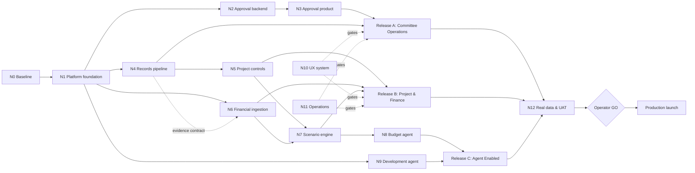

# strata.ai — engineering implementation plan

Version: 1.0

Date: 15 August 2026

Target property: SP 6430 / 33 Malvern Avenue, Manly NSW

Audience: engineering, product, design, QA, data/AI and operations

## How to use this plan

This is the active engineering delivery plan for the full 33 Malvern Avenue product. It is designed to be converted into epics and tickets in the team's normal tracker.

Repository sources remain authoritative for implementation details:

- Read `AGENTS.md` before starting.
- Read the relevant installed Next.js documentation under `node_modules/next/dist/docs/` before changing Next.js code.
- Read `node_modules/eve/docs/README.md` and relevant installed Eve documentation before changing Eve.
- Treat current code, schema, tests and deployed behaviour as stronger evidence than older status documents.
- Use `FRONTEND-CONTRACT.md` and `IMPLEMENTATION_PLAN_ADDENDUM.md` as supporting contracts.
- Treat `GRAPH-PLAN.md`, `GRAPH-STATE.md`, `GO-NO-GO.md` and `HANDOFF.md` as historical evidence; their earlier decision to defer project/budget work has been superseded by the current product scope.

## Verdict

The repository is a strong technical alpha, not a committee-ready production system. The team should retain the existing Next.js, Supabase and Eve foundation and complete the product in three releases:

1. **Committee Operations** — safe production foundation, issues, documents and evidence-backed asynchronous approvals.
2. **Project and Financial Intelligence** — extraction, project controls, reconciled financial comparison and deterministic scenarios.
3. **Agent-Enabled Operations** — proactive budget agent and controlled product-development intake agent.

The full target is approximately **28–40 engineer-weeks**. With two full-stack engineers, a 0.5–1.0 data/AI engineer and part-time product/design/QA, the expected duration is **14–20 calendar weeks**. A useful committee-operations pilot should be available after approximately **7–9 weeks**.

Production promotion remains a separate human release decision after UAT and operational gates pass.

## Product objective

Deliver one secure application in which the owner-members of the 33 Malvern Avenue strata committee can:

- Raise and discuss building issues.
- Review all evidence relevant to a proposed decision.
- Give asynchronous approval in the same way they currently respond “I approve” by email.
- See a permanent, searchable decision and action record.
- Monitor large projects, timelines, milestones, variations, risks and spend.
- Compare financial periods, budgets and expense movements.
- Model future levies, expenditure, project timing and cash reserves.
- Ask a budget agent for cited explanations and proactive draft recommendations.
- Submit authorised product requests through Telegram/WhatsApp into a controlled Linear/GitHub engineering workflow.

## Scope

### In scope

- Committee-only identity, membership and capabilities.
- Issues, comments, actions and evidence.
- Asynchronous committee approvals.
- Documents, extraction/OCR, review and provenance.
- Project-control and project-financial views.
- Accounting export import, reconciliation and period comparison.
- Deterministic budget/levy scenarios.
- Read-mostly budget agent and proactive draft recommendations.
- Separate development-request agent with human-gated external effects.
- Production operations for one building.

### Out of scope

- AGM/general-meeting management.
- Formal statutory owners-corporation voting or secret ballots.
- Replacing the strata manager's accounting ledger.
- Automatic payments, levy changes or supplier approvals.
- AI-confirmed financial truth.
- Autonomous agent merge, deployment or production mutation.
- Multi-strata self-service tenancy and billing for this release.

## Current implementation baseline

The team must re-verify this during Sprint 0; it is a starting point, not completion evidence.

### Existing strengths

- Next.js 16.3 / React 19 application.
- Supabase Auth, Postgres, Storage and RLS foundation.
- Password recovery, member invitations and lifecycle management.
- Cards/issues, messages, proposals, votes and approval-condition primitives.
- Document upload and evidence linking.
- Dashboard, search, projects and budget presentation primitives.
- Eve agent with scoped evidence tools, draft-write gates and eval fixtures.
- Existing source/static/browser verification scripts.
- Historical immutable Preview candidate for commit `be4c4d0`.

### Confirmed gaps to address

- Production has historically been errored while only Preview was Ready.
- Data reads can fall back to demo records after Supabase failure.
- Some API routes can report mock success when configuration is absent.
- `read_only` is not enforced as a general write capability.
- Audit actor integrity and transaction boundaries are insufficient.
- Repository and live migration histories have drifted.
- Verification fixtures are mixed with prospective real data.
- Existing vote/audience/status mappings do not represent the target approval workflow accurately.
- PDF/DOCX extraction worker, signed download, versioning and records lifecycle are incomplete.
- Projects and budgets are mostly read-only and lack the required control models.
- Financial import/reconciliation, deterministic scenarios and proactive agents are not complete.
- CI, monitoring, restore rehearsal and production runbooks are incomplete.

## Definition of done

The product is complete only when each criterion below has direct test or user-visible evidence.

| ID | Criterion | Evidence required |
|---|---|---|
| DOD-01 | Environment isolation and fail-closed behaviour | Separate staging/production; outage and missing-config tests never show demo data or mock success |
| DOD-02 | Capability and data isolation | Route and direct-database tests for admin, financial confirmer, member, read-only, suspended and outsider |
| DOD-03 | Committee approval journey | Versioned evidence, participant snapshot, responses, request-information, reminders, supersession and immutable outcome |
| DOD-04 | Records journey | Upload, validation, extraction, review, signed download, version/checksum, retention metadata and evidence linking |
| DOD-05 | Project journey | Timeline, milestones, risks, approvals, baseline, commitments, invoices, payments, forecast and evidence |
| DOD-06 | Financial reconciliation | Two or more comparative periods reconcile to approved source exports and drill down to source rows |
| DOD-07 | Scenario determinism | Same versioned inputs produce the same outputs and match an independent reference calculator |
| DOD-08 | Budget-agent safety and usefulness | Cited confirmed data, deterministic arithmetic, freshness/assumptions and no official mutations |
| DOD-09 | Development-agent control | Authorised Telegram request routes correctly; external artifacts are human-approved; no merge/deploy/production access |
| DOD-10 | UX quality | Mobile/desktop, keyboard, WCAG AA essentials, deep links, clear states and chart table alternatives |
| DOD-11 | Operational readiness | CI, monitoring, alerting, backups, restore test, RPO/RTO, runbooks and rollback target |
| DOD-12 | Real-building acceptance | Fixtures isolated, real data reconciled, committee UAT signed and production smoke passed |

## Edge Audit

| Claimed dependency | Classification | Delivery decision |
|---|---|---|
| Complete every feature before releasing anything | Fake barrier | Release committee operations first; project/finance/agents can follow behind stable contracts |
| UI must wait for database completion | Mostly fake | Freeze JSON/API contracts, then build backend and frontend in parallel; converge at wiring/E2E |
| Project work must wait for financial import | Fake | Project operational model and UI can start once contracts exist; only project actuals/forecast fan-in requires finance |
| Financial dashboard must wait for document extraction | Partial | Accounting export ingestion can begin independently; evidence links and invoice extraction join later |
| Scenarios can start with mocked financial data | Unsafe shortcut | UI prototyping may use contract fixtures, but production engine waits for approved project/financial contracts |
| Budget agent can be built before deterministic tools | Real dependency | Do not build numeric recommendation behaviour until scenario/read tools are stable and verified |
| Development-request agent must wait for product completion | Fake | It can begin after CI/security/sandbox boundaries exist; it remains off the product critical path |
| Real data import should start immediately | Policy/data gate | Inventory may start; private ingestion waits on source scope, retention and confirmer decisions |
| Production deployment is another engineering task | Human/release gate | Exact candidate, migrations, UAT, backup and rollback evidence must fan in before operator approval |

## Node Inventory

| Node | Engineering outcome | Depends on | Output contract | Estimate |
|---|---|---|---|---:|
| N0 Baseline | Current repository, database and deployment truth | None | Signed baseline/gap report; protected worktree | 3–5 d |
| N1 Platform foundation | Isolated, fail-closed, capability-safe platform | N0 | Clean migration replay; security and environment gates | 15–20 d |
| N2 Approval backend | Correct asynchronous approval domain | N1 | Schema, RLS, transactional APIs and tests | 10–14 d |
| N3 Approval product | Mobile evidence/approval/decision experience | N2 contract | UI, notifications, register and E2E | 8–12 d |
| N4 Records pipeline | Usable documents and reviewed extraction | N1 | Retrieval, versions, worker, review, retention | 12–16 d |
| N5 Project controls | Auditable large-works operational and financial model | N1 + N4 contract | Project APIs, read models, extraction and UI | 18–24 d |
| N6 Financial intelligence | Reconciled periods and comparison UI | N1; N4 contract for evidence | Import, reconciliation, read models and dashboard | 20–28 d |
| N7 Scenario engine | Reproducible levy/project cash-flow planning | N5 + N6 contracts | Versioned engine, reference tests and UI | 10–15 d |
| N8 Budget agent | Cited read tools and proactive drafts | N7 + confirmed data | Eve tools, policy, evals, schedules | 12–18 d |
| N9 Development agent | Controlled chat-to-issue/PR pipeline | N1 CI/security | Separate Eve agent, channel, router and gates | 10–14 d |
| N10 UX system | Consistent accessible committee interface | Contracts from N2–N7 | Navigation, tokens, shared states and QA | 8–12 d across tracks |
| N11 Operations | Automated and observable release system | N1 then all tracks | CI, monitoring, backup/restore and runbooks | 8–12 d |
| N12 Onboarding/UAT | Reconciled 33 Malvern workspace | Product tracks | Real data, UAT evidence and release candidate | 8–12 d |

Estimates are engineering days and include implementation plus automated verification, not committee availability or external legal/accounting review.

## Topology



Topology notes:

- `N0 -> N1` is the only universal serial prefix.
- Backend and frontend work split after each contract is frozen and converge at E2E verification.
- Project and financial tracks are parallel arms; the scenario engine is their real fan-in.
- Budget agent consumes verified deterministic read/calculation tools.
- Development agent is an independent track after CI/security boundaries exist.
- UX and operations are continuous gates, not final cleanup phases.

## Critical Path

### First usable committee release

`N0 -> N1 -> N2 -> N3 -> essential N4 -> UX/operations gate -> committee pilot`

Expected duration: 7–9 calendar weeks with the recommended team.

### Full target product

`N0 -> N1 -> N4 -> (N5 || N6) -> N7 -> N8 -> N12 -> production approval`

The scenario engine and budget agent are the binding chain after project and financial work converge. The development agent can run in parallel and should not delay the committee application unless explicitly made a launch requirement.

### Likely review bottlenecks

- Confirming real financial figures and mappings.
- Reviewing extracted project data.
- Committee UAT availability.
- Security review of capability/RLS changes.
- Meta/Telegram/GitHub/Linear credential and permission setup.

## Unblock-Now

Resolve during Sprint 0:

1. Name the users/roles permitted to confirm official financial figures.
2. Approve private document/email sources, date ranges, confidentiality and retention.
3. Confirm whether strata manager users are members, read-only collaborators or administrators.
4. Identify authoritative accounting export formats and obtain anonymised fixtures.
5. Select the first major project for end-to-end onboarding.
6. Define approval defaults: named participants, threshold/unanimous/advisory and due-date/reminder expectations.
7. Confirm production/staging Supabase strategy and owners.
8. Confirm whether Telegram is the first development-agent pilot channel; defer WhatsApp credentials until the flow is proven.
9. Name production support, security review and release-approval owners.
10. Confirm the historical periods required at launch, recommended minimum: current year, prior year and budget.

## Target technical architecture

### Application

- Next.js 16 App Router for the web application and authenticated HTTP boundary.
- React Server Components for initial server-side data reads where appropriate.
- Supabase Auth for identity/session.
- Supabase Postgres for committee, approvals, records, projects, finance, scenarios and audit.
- Supabase Storage for private raw and derived documents.
- Background worker/job mechanism for extraction and scheduled processing.
- Eve for the budget agent and a separate Eve deployment for development intake.
- Chat SDK adapter for Telegram first; WhatsApp Business Cloud second.

### Environment boundary

Maintain physically/logically separate staging and production data environments.

- Local: developer-only data and fixtures.
- Staging/Preview: synthetic or approved anonymised data; mutation-heavy automated verification allowed.
- Production: 33 Malvern data only; no test fixtures, mock writes or demo fallbacks.

No Preview verifier may mutate Production.

### Data status model

Use explicit statuses on extracted/financial values:

- `draft_extracted`
- `under_review`
- `confirmed`
- `rejected`
- `conflicted`
- `superseded`

Confirmed values require a server-derived confirmer and timestamp. Conflicts remain visible until an authorised resolution; never silently select a source.

### Source priority

1. Approved accounting export for actual transactions/fund balances.
2. Reconciled paid invoice/payment record.
3. Executed contract or approved variation.
4. Committee-confirmed forecast.
5. Extracted draft from minutes, quote, spreadsheet or correspondence.

### Capability model

Implement capabilities independently of display roles:

- `manage_members`
- `manage_building_settings`
- `create_issue`
- `comment`
- `request_approval`
- `respond_to_approval`
- `withdraw_approval`
- `manage_documents`
- `manage_projects`
- `import_financial_data`
- `confirm_financial_figures`
- `manage_budget_scenarios`
- `use_budget_agent`
- `approve_agent_drafts`
- `view_audit`

The server derives user, committee and capabilities. Do not trust client-supplied actor, role or committee values.

## Detailed engineering backlog

Estimates are working ranges in engineer-days. Each ticket is complete only when its acceptance criteria and automated tests pass.

### Epic FND — baseline, environments and migrations

| ID | Ticket | Estimate | Depends on | Acceptance |
|---|---|---:|---|---|
| FND-01 | Produce current baseline report | 2–3 d | None | Current git, dependency, Preview/Production, Supabase migration/advisor and data-fixture state recorded |
| FND-02 | Establish staging and production data environments | 3–5 d | FND-01 | Separate credentials, projects/branches, configuration matrix and no shared mutation path |
| FND-03 | Reconcile migration history and baseline | 3–5 d | FND-01 | Every live migration represented; clean database replay succeeds; remote/local parity documented |
| FND-04 | Remove production demo fallback/mock success | 2–3 d | FND-01 | Missing config/query failure/mutation failure returns explicit error; negative tests pass |
| FND-05 | Centralise environment validation | 1–2 d | FND-02 | Typed server/client configuration; server secrets cannot enter client bundle |
| FND-06 | Fixture and seed isolation | 2 d | FND-02 | Test fixtures live only in local/staging; production sentinel check passes |

### Epic SEC — permissions, audit and transactional integrity

| ID | Ticket | Estimate | Depends on | Acceptance |
|---|---|---:|---|---|
| SEC-01 | Define capability matrix and personas | 1–2 d | Unblock decisions | Product/security sign-off; direct mapping to route/RLS tests |
| SEC-02 | Enforce capabilities in route handlers/RPCs | 3–5 d | SEC-01 | Every write checks server-derived capability; read-only negative suite passes |
| SEC-03 | Rewrite/extend RLS for capabilities | 4–6 d | SEC-01, FND-03 | Direct Data API cannot bypass route restrictions; cross-committee tests pass |
| SEC-04 | Harden audit actor and append-only policy | 2–3 d | FND-03 | Ordinary users cannot forge actor/time or update/delete audit records |
| SEC-05 | Transactional workflow RPCs | 3–5 d | SEC-04 | Business mutation and audit commit/rollback together; idempotency tests pass |
| SEC-06 | Security baseline | 2–3 d | FND-02 | Zero high/critical dependency issues; leaked-password protection; MFA plan; rate limit |

### Epic APR — committee approvals

| ID | Ticket | Estimate | Depends on | Acceptance |
|---|---|---:|---|---|
| APR-01 | Freeze approval API/UI contract | 1–2 d | SEC-01 | Product-approved JSON contracts and lifecycle diagram |
| APR-02 | Add approval schema | 3–4 d | APR-01, FND-03 | Requests, evidence versions/items, participants, responses, events and deliveries with RLS |
| APR-03 | Add transactional approval operations | 3–5 d | APR-02, SEC-05 | Create/respond/change/request-info/withdraw/expire/supersede/finalise operations are idempotent and audited |
| APR-04 | Implement approval inbox/detail UI | 4–6 d | APR-01 in parallel; APR-03 for wiring | Mobile/desktop pending/completed filters; evidence and participant state; accessible actions |
| APR-05 | Implement notification/deep-link delivery | 2–3 d | APR-03 | Email links exact approval/version; retries/delivery state; no duplicate sends |
| APR-06 | Implement decision register/export | 2–3 d | APR-03 | Immutable outcome, response/evidence history, CSV/PDF export and source links |
| APR-07 | Approval E2E and concurrency suite | 2–3 d | APR-03–06 | Two clients, repeat requests, expiry and supersession cases pass |

Required approval behaviour:

- Named participant snapshot.
- Rule: unanimous, threshold, named subset or advisory.
- Responses: approve, decline, abstain, request information.
- Due date, reminders, expiry, withdrawal and supersession.
- Evidence-pack version/checksum.
- Material evidence/question/amount change creates a new version; previous approvals do not silently carry forward.
- Final result is immutable with a controlled correction trail.

### Epic DOC — records and extraction

| ID | Ticket | Estimate | Depends on | Acceptance |
|---|---|---:|---|---|
| DOC-01 | Signed document retrieval/preview | 2–3 d | FND-02, SEC-03 | RLS-protected signed access; hidden-document negative tests |
| DOC-02 | Version/checksum/source metadata | 2–3 d | FND-03 | Duplicate detection; previous versions retained and linked |
| DOC-03 | Extraction worker and job lifecycle | 4–6 d | DOC contract | PDF/DOCX/XLSX/image fixtures; retry/dead-letter; parser/model version and locators |
| DOC-04 | Human extraction review queue | 3–4 d | DOC-03, SEC-02 | Confirm/correct/hold/reject; server-derived reviewer; audit; draft values stay unofficial |
| DOC-05 | Retention/archive/legal-hold/access export | 2–3 d | Policy decision | Metadata and permission tests; export/download audit |
| DOC-06 | Orphan/idempotency reconciliation | 1–2 d | Existing upload flow | Partial upload/row/link failure cleans or reconciles deterministically |

### Epic PRJ — project controls

| ID | Ticket | Estimate | Depends on | Acceptance |
|---|---|---:|---|---|
| PRJ-01 | Freeze project-control contracts | 2 d | Addendum review | JSON contracts for overview, timeline, costs, updates, risks, evidence and imports |
| PRJ-02 | Implement project/control schema and RLS | 4–6 d | PRJ-01, FND-03 | Projects, milestones, updates, risks, budget lines, append-only cost events and evidence links |
| PRJ-03 | Implement deterministic project read models | 3–5 d | PRJ-02 | Baseline, variations, committed, invoiced, paid, remaining, final forecast and contingency reconcile |
| PRJ-04 | Project import/extraction candidates | 3–4 d | DOC-03, PRJ-02 | Minutes/payment sheets/quotes produce cited drafts routed to review |
| PRJ-05 | Project dashboard and timeline | 4–6 d | PRJ-01 in parallel; PRJ-03 for wiring | Summary, milestone/Gantt, update rail, risk panel and evidence rail; mobile priorities |
| PRJ-06 | Variation/invoice decision queue | 2–3 d | PRJ-03, APR-03 | Financial event linked to project line, evidence and approval request |
| PRJ-07 | Project export and E2E | 2 d | PRJ-04–06 | One real project traceable end to end; export totals match read model |

### Epic FIN — financial ingestion and dashboard

| ID | Ticket | Estimate | Depends on | Acceptance |
|---|---|---:|---|---|
| FIN-01 | Freeze financial contracts and source mapping | 2–3 d | Accounting fixtures | Funds, periods, accounts, transactions, budgets, levies and reconciliation contracts approved |
| FIN-02 | Implement financial schema/RLS | 3–5 d | FIN-01, FND-03 | Versioned periods/imports/budgets with committee isolation and status model |
| FIN-03 | CSV/XLSX import preview and mapping | 4–6 d | FIN-01, DOC-03 optionally | Column/account/vendor mapping, validation, idempotency and exception review |
| FIN-04 | Reconciliation, period lock and reversal | 4–6 d | FIN-02/03 | Opening/closing and movements reconcile; unmapped rows block false success; controlled correction |
| FIN-05 | Financial read models | 3–4 d | FIN-04 | Actual/budget/prior period/fund/project/category/vendor aggregates share one source of truth |
| FIN-06 | Dashboard, comparisons and drill-down | 4–6 d | FIN-01 in parallel; FIN-05 for wiring | Fund summary, trends, grouped comparison, waterfall variance, project spend and source drill-down |
| FIN-07 | Accessible chart/table/export contract | 2–3 d | FIN-06 | Exact table parity, AUD formatting, legends/labels, CSV and URL filter state |
| FIN-08 | Financial E2E and regression suite | 2 d | FIN-03–07 | Two periods import/reconcile; repeat import, correction, drill-down and role cases pass |

### Epic SCN — deterministic scenario planning

| ID | Ticket | Estimate | Depends on | Acceptance |
|---|---|---:|---|---|
| SCN-01 | Freeze scenario input/output contract | 1–2 d | PRJ-03, FIN-05 | Assumptions, horizons, cash-flow outputs and version rules approved |
| SCN-02 | Implement versioned calculation engine | 3–5 d | SCN-01 | Monthly/quarterly balances, low point, threshold, closing balance and levy range |
| SCN-03 | Persistence, clone, compare and archive | 2–3 d | SCN-02 | Base/conservative/stress/custom scenarios; immutable versions |
| SCN-04 | Independent reference calculator/tests | 2–3 d | SCN-01 in parallel | Benchmarks match; invalid assumptions fail; same input/version yields canonical same result |
| SCN-05 | Scenario UI and export | 3–4 d | SCN-01 in parallel; SCN-03 wiring | Assumptions, cash-flow chart/table, scenario diff, source freshness and CSV/PDF export |

Calculation inputs:

- Opening fund balances.
- Levy and special-levy schedules.
- Recurring expenditure and inflation.
- Project commitments, forecasts and timing.
- Contingency and uncosted exposure.
- Arrears/payment-delay assumptions when available.
- Reserve target and forecast horizon.

The LLM must not perform these calculations.

### Epic AIA — budget agent

| ID | Ticket | Estimate | Depends on | Acceptance |
|---|---|---:|---|---|
| AIA-01 | Define agent policy and data boundary | 1–2 d | SEC-01, SCN contract | Confirmed/draft/stale rules, allowed tools, prohibited effects and disclaimer approved |
| AIA-02 | Implement financial/project read tools | 3–4 d | PRJ-03, FIN-05 | Server-derived scope, citations, freshness and hidden-record denial |
| AIA-03 | Implement deterministic scenario tool | 1–2 d | SCN-02 | Agent receives calculation output; cannot supply hidden arithmetic |
| AIA-04 | Implement approval-gated draft tools | 2–3 d | APR-03, SEC-02 | Draft scenario/recommendation/approval only; no official mutation |
| AIA-05 | Proactive recommendation scheduler | 2–3 d | AIA-02–04 | Materiality, cooldown, dedupe across accepted/dismissed/snoozed and idempotent runs |
| AIA-06 | Evals and observability | 3–4 d | AIA-02–05 | Arithmetic, citations, hidden/stale/draft data, cross-session, duplicate alert and prohibited-write evals |

Initial proactive recommendations:

- Material actual-versus-budget variance.
- Project forecast beyond approved budget/contingency.
- Forecast reserve-threshold breach.
- Upcoming commitment without confirmed funding.
- Stale/unreconciled period.
- Unusual duplicate/vendor/category movement.

All recommendations are drafts with sources, assumptions, calculation version, freshness and dismiss/snooze controls.

### Epic DEV — product-development intake agent

| ID | Ticket | Estimate | Depends on | Acceptance |
|---|---|---:|---|---|
| DEV-01 | Define separate agent threat/permission model | 1–2 d | SEC baseline | No building data/production credentials; exact GitHub/Linear/channel scopes |
| DEV-02 | Telegram adapter, webhook verification and identity | 2–3 d | DEV-01 | Authorised allowlist; signature/secret verification; update dedupe |
| DEV-03 | Durable request state and router | 2–3 d | DEV-02 | Fingerprint, clarification, duplicate/superseded/rejected state and routing rules |
| DEV-04 | Linear/GitHub external artifact gates | 2–3 d | Credentials/human gate | Explicit approval before artifact creation; minimum permissions; cross-links |
| DEV-05 | Isolated maker/checker coding flow | 3–4 d | CI baseline | Worktree/sandbox, task contract, independent verifier and draft PR only |
| DEV-06 | WhatsApp adapter | 1–2 d | Telegram pilot accepted | Business Cloud webhook/channel works with the same normalized state/handlers |
| DEV-07 | Safety/eval suite | 2 d | DEV-02–06 | Unmapped user, duplicate, high-risk, failed gate, prohibited merge/deploy cases stop correctly |

Routing rules:

- Ambiguous idea: clarify, then Linear backlog.
- Clear large feature: Linear specification; wait for `ready-for-agent`.
- Reproducible low-risk defect: approved coding-agent run.
- Security, auth, financial calculation, migration or dependency change: senior-engineer gate.
- Duplicate: link existing work and stop.

The development agent may create a draft PR only after approved intake and verification. It never merges, deploys, changes permissions or accesses Production.

### Epic UX — shared product quality

| ID | Ticket | Estimate | Depends on | Acceptance |
|---|---|---:|---|---|
| UX-01 | Navigation and route/deep-link architecture | 2–3 d | Product IA | Home, Issues, Approvals, Projects, Finances, Scenarios, Documents, Assistant and permitted Settings |
| UX-02 | Semantic design tokens and typography | 1–2 d | None | Light-first calm financial system; accessible contrast; tabular figures; no ad hoc colours |
| UX-03 | Shared loading/error/empty/read-only states | 2–3 d | Existing components | Retry paths, no blank charts, read-only distinct from disabled, accessible announcements |
| UX-04 | Responsive/mobile approval and data views | 2–3 d | Feature screens | 375/768/1024/1440 widths; no horizontal page scroll; 44px targets |
| UX-05 | Accessibility and browser QA | 2–3 d each release | Integrated Preview | Keyboard, focus, headings, labels, screen-reader summaries, reduced motion and chart alternatives |

### Epic OPS — CI, observability and release operations

| ID | Ticket | Estimate | Depends on | Acceptance |
|---|---|---:|---|---|
| OPS-01 | Pull-request CI | 2–3 d | FND-01 | Lock install, lint, type, build, migrations, RLS, unit/integration/E2E and audit gates |
| OPS-02 | Application/job/agent observability | 2–3 d | N1 contracts | Request IDs, structured errors, health, worker queues, webhook and Eve run visibility |
| OPS-03 | Alerting and incident ownership | 1–2 d | OPS-02 | Alert thresholds, routing, severity and named owner |
| OPS-04 | Backup/PITR and restore rehearsal | 2–3 d | Environment isolation | Documented RPO/RTO; timed restore evidence and verification |
| OPS-05 | Release/rollback runbook | 1–2 d | CI/deployment model | Exact candidate, migrations, health, smoke, rollback target/triggers |
| OPS-06 | Production smoke and seven-day monitoring | 1–2 d | Operator GO | Bounded smoke records, monitoring report and issue disposition |

### Epic ONB — 33 Malvern data and UAT

| ID | Ticket | Estimate | Depends on | Acceptance |
|---|---|---:|---|---|
| ONB-01 | Real-data inventory and mapping | 1–2 d | Private-source scope | Source owner, date, confidentiality, authoritative status and destination recorded |
| ONB-02 | Building/member onboarding | 1–2 d | SEC capability model | Correct branding, active committee, read-only/financial capabilities and invite journey |
| ONB-03 | Core records/project import | 2–3 d | DOC/PRJ | By-laws, recent minutes, contracts, insurance/compliance and first major project linked/reviewed |
| ONB-04 | Financial history import/reconciliation | 2–3 d | FIN | Required periods reconcile; uncertainties remain draft/conflicted |
| ONB-05 | Committee UAT and training | 2–3 d | Release candidate | Six journeys signed; operating guide and support path provided |
| ONB-06 | Fixture removal/isolation proof | 1 d | Production seed | Fixture sentinels absent; counts/reconciliation signed |

## API and database contract guidance

The team may refine names during contract review, but should preserve the following domain boundaries.

### Approval domain

- `approval_requests`
- `approval_evidence_versions`
- `approval_evidence_items`
- `approval_participants`
- `approval_responses`
- `approval_events`
- `notification_deliveries`

Prefer transactional RPCs for create/respond/supersede/finalise operations rather than several unrelated client writes.

### Project domain

- projects/workstreams
- project milestones/dependencies
- project updates/minutes
- project risks/issues/actions
- contracts/vendors
- project budget lines
- append-only project cost events
- variations/invoices/payment status
- project evidence links

### Financial domain

- financial periods/funds/accounts/vendors
- imports/import rows/mapping rules
- transactions
- budget versions/entries
- levy schedules
- reconciliation runs

### Scenario domain

- scenarios
- scenario versions
- assumptions
- canonical projections
- calculation-engine version
- exports

## Verification strategy

### Existing gates to retain

Run as relevant:

```text
npm run lint
npx tsc --noEmit
npm run build
npm run verify:security
npm run verify:frontend-contract
npm run verify:recovery
npm run verify:dashboard
npm run verify:drilldown
npm run verify:search
npm run verify:projects
npm run verify:admin
npm run verify:workflow-ui
npm run verify:documents-ui
npm run verify:eve-tools
npm run verify:eve-evals
npm audit --omit=dev --audit-level=high
```

### New gates to add

Use these names or document an equivalent mapping:

- `verify:fail-closed`
- `verify:capabilities`
- `verify:audit-integrity`
- `verify:migration-replay`
- `verify:environment-isolation`
- `verify:approval`
- `verify:records`
- `verify:project-controls`
- `verify:finance-import`
- `verify:finance-ui`
- `verify:scenario`
- `verify:budget-agent`
- `verify:dev-agent`
- `verify:e2e`
- `verify:production-smoke`

### Testing pyramid

- Database: migration replay, RLS adversarial tests, RPC transaction/idempotency tests and deterministic view calculations.
- Application: route validation, capability, failure and error-state tests.
- UI: component interaction/accessibility and chart/table equality.
- Browser: required journeys on immutable Preview.
- Agent: eval fixtures for scope, citations, arithmetic, freshness, cross-session isolation and prohibited effects.
- Production: bounded, non-destructive smoke after approved deployment.

### Maker/checker rule

The feature implementer may run tests but should not be the only verifier for:

- Capability/RLS security.
- Financial reconciliation and scenario arithmetic.
- Approval lifecycle/concurrency.
- Accessibility and committee usability.
- Agent permission boundaries.
- Production release decision.

## Definition of ready and definition of done

### Ticket ready

- Outcome and user/persona named.
- Contract or interface identified.
- Dependencies met.
- Allowed data/environment named.
- Acceptance criteria and negative cases written.
- Verification command/approach identified.
- Security/privacy/release implications reviewed.

### Ticket done

- Code/schema/documentation complete.
- Narrow tests and relevant regression gates pass.
- Error/loading/empty/read-only states exist where applicable.
- Audit/provenance and role cases pass.
- Migration rollback/forward plan exists if schema changed.
- User-visible behaviour verified in Preview if applicable.
- Reviewer independent of implementer approves.
- Evidence linked from the ticket.

### Epic done

- Every ticket done.
- Epic E2E journey passes.
- No unresolved P0/P1 issue.
- Contract documentation matches shipped behaviour.
- Product owner accepts the epic outcome.

## Release plan

### Sprint 0 — baseline and contract workshop, week 1

- FND-01 and current-state verification.
- Resolve Unblock-Now decisions.
- Capability, approval, records, project and financial contract workshops.
- Finalise staging/production strategy.
- Establish tracker, ownership, branch/review conventions and release scorecard.

Exit: approved contracts, current evidence and unblocked Sprint 1 backlog.

### Release A — committee operations, weeks 2–9

Parallel streams:

- Platform/backend: FND, SEC, APR backend, DOC foundations.
- Product/frontend: approval UI against contract, navigation/shared states.
- QA/ops: CI, RLS adversarial suite, Preview E2E, monitoring skeleton.

Exit:

- Secure login and committee capabilities.
- Issues/comments/actions.
- Documents and essential evidence retrieval.
- Evidence-backed asynchronous approval.
- Decision register.
- Committee pilot on isolated Preview/staging.

### Release B — project and financial intelligence, weeks 6–15

Start contract/UI work before Release A completes; wire after foundations pass.

Parallel streams:

- Project: PRJ model/read models/extraction/UI.
- Finance: FIN import/reconciliation/read models/UI.
- Records/data: extraction fixtures and review queue.
- Scenario: contract/reference calculator may begin once PRJ/FIN contracts freeze.

Exit:

- One real major project reconstructed with evidence.
- Required financial periods reconciled.
- Period/budget/project comparison dashboards.
- Deterministic saved scenarios and exports.

### Release C — agents and full launch, weeks 14–20

- Budget-agent tools, evals and proactive drafts.
- Telegram development-agent pilot; WhatsApp after acceptance.
- Full 33 Malvern onboarding.
- Restore rehearsal, production runbook and committee UAT.
- Exact candidate release and monitored production launch after GO.

## Staffing and ownership

Recommended minimum team:

| Role | Allocation | Primary ownership |
|---|---:|---|
| Tech lead / senior full-stack | 1.0 | Architecture, security, reviews, release |
| Full-stack product engineer | 1.0 | Approval/project/finance UI and application APIs |
| Data/AI engineer | 0.5–1.0 | Extraction, financial import, scenario engine, Eve agents |
| Product owner | 0.3–0.5 | Scope, acceptance, committee coordination |
| Product designer | 0.2–0.4 | IA, financial visualisation, mobile/accessibility |
| QA/automation | 0.3–0.5 | E2E, accessibility, regression and release evidence |
| Strata/financial confirmer | As needed | Source authority, reconciliation and UAT |

### RACI summary

| Decision/work | Engineering | Product owner | Financial confirmer | Committee pilot | Operator |
|---|---|---|---|---|---|
| Technical design | R/A | C | I | I | I |
| Product scope/approval semantics | C | A/R | C | C | I |
| Financial source/mapping | R | C | A | I | I |
| Security review | R/A | I | I | I | C |
| UAT | R | A | R | R | I |
| Production GO | C | R | C | C | A |

## Engineering working agreement

- Small, reviewable pull requests tied to one ticket/outcome.
- Contract-first work when backend/frontend can proceed independently.
- One schema migration per coherent domain change; never edit a migration already applied remotely without an approved reconciliation strategy.
- Feature flags for incomplete high-surface-area features.
- No fixture or fallback behaviour available in Production.
- Financial and approval invariants receive failing tests before or with implementation.
- Every PR states security/data impact, migrations, test evidence and rollback risk.
- Preview verification occurs on the exact PR/release revision.
- Do not weaken tests to pass CI.

## Production release gates

All must pass on the exact candidate:

- Production target is Ready and a tested rollback target exists.
- Environment isolation and fail-closed tests pass.
- No fixture/demo records or mock success paths.
- Zero high/critical production dependency findings.
- Clean migration replay and remote parity.
- Capability/RLS matrix passes for every persona.
- Approval, records, project, finance and scenario E2E journeys pass.
- Financial source totals reconcile and scenario reference tests pass.
- Budget/development agent evals pass; prohibited effects are proven denied.
- Mobile/desktop/accessibility/browser matrix passes.
- Backup restore rehearsal completed within target RTO.
- Monitoring/alerts/support ownership active.
- UAT and product/security/financial sign-offs recorded.
- Operator approves the exact revision, migrations and rollback plan.

## Risk register

| Risk | Severity | Mitigation |
|---|---|---|
| Demo fallback masks an outage | P0 | Remove production fallback; fail-closed automated tests |
| Read-only member performs writes | P0 | Capability matrix in routes/RPCs and RLS; direct database negative tests |
| Approval applies to changed evidence | P0 | Evidence version/checksum; supersession; response binding |
| Extracted value appears official | P0 | Draft/confirmed status; human transition; views exclude drafts; adversarial tests |
| Project and ledger totals diverge | P0 | Append-only cost events, reconciliation and common read models |
| Scenario arithmetic is wrong/non-repeatable | P0 | Versioned deterministic engine plus independent calculator |
| Agent performs unauthorised action | P0 | Separate identities/environments, minimum tools, approval gates and evals |
| Preview tests mutate production | P0 | Environment isolation and sentinel tests |
| Committee review becomes bottleneck | P1 | Limit extraction queue; prioritise one project/period; batch review sessions |
| Scope grows into full strata/AGM platform | P1 | Enforce non-goals and change-control process |
| WhatsApp setup delays launch | P2 | Pilot development agent on Telegram; WhatsApp after core flow works |

## Initial ten-working-day plan

### Days 1–2

- Run FND-01 current-state audit.
- Create tracker epics/tickets from this plan.
- Protect current dirty paths and agree branch/PR policy.
- Assign owners and reviewers.

### Days 3–4

- Resolve Unblock-Now product/data decisions.
- Freeze capability and approval contracts.
- Decide staging/production Supabase approach.
- Obtain anonymised accounting/document fixtures.

### Days 5–7

- Start FND-02/03 environment and migration work.
- Start FND-04 fail-closed implementation/tests.
- Draft SEC route/RLS adversarial matrix.
- Prototype approval UI against frozen fixtures.

### Days 8–10

- Land CI baseline and migration replay gate.
- Begin SEC capability/audit work.
- Begin approval schema/RPC implementation.
- Freeze records extraction contract.
- Demonstrate the first contract-backed approval screen and publish Sprint 1 evidence.

## Final handover artifacts

The team must deliver:

- Architecture decision records.
- API and domain contracts.
- Canonical migration manifest and replay evidence.
- Role/capability/RLS test matrix.
- Reconciliation and scenario benchmark reports.
- Agent policy/eval reports.
- Accessibility/browser report.
- Data-import and fixture-isolation report.
- UAT sign-offs.
- Release manifest, runbook and rollback plan.
- Monitoring, incident and backup/restore evidence.
- Known limitations and prioritised post-launch backlog.

The project is complete when the committee can use the production system for routine issues, evidence-backed approvals, project monitoring, financial comparison and planning—with agents operating inside their explicit boundaries—not when the feature branches merely merge.
