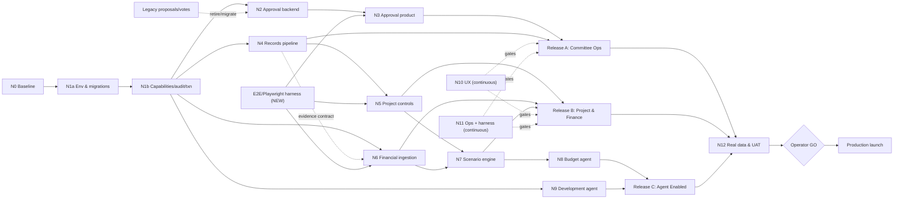

# strata.ai — Engineering Implementation Plan Review

Reviewer: Independent principal-engineering review panel (platform, appsec/privacy, data/financial-systems, agent-safety, delivery/estimation, QA/release).
Plan under review: `ENGINEERING-IMPLEMENTATION-PLAN.md` (v1.0, 15 Aug 2026).
Repository HEAD at review: `be4c4d0` on branch `codex/strata-v1-release-candidate`.
Nature of review: read-only. No application code, migrations, schema, deployment or database state was changed.

## Verdict

**APPROVE WITH REQUIRED CHANGES.** Engineering should start **only the safe Sprint 0 work** (FND-01 baseline, Unblock-Now decisions, contract freezes, environment strategy) and must **not** commit to the current calendar/estimate or begin Release B/C build until the required plan changes below are made.

The plan's architecture, safety model and sequencing are fundamentally sound and correctly matched to the product intent: it keeps AGM/statutory-ballot scope out, models asynchronous email-style consent rather than legal voting, imposes a draft→confirmed data lifecycle with server-derived confirmers, keeps the LLM out of arithmetic, and separates the budget agent from a human-gated development agent. The dangerous current behaviours it promises to remove are real and I verified them in the repo (mock-success finance route, demo-data fallback, no `read_only` write enforcement, non-transactional audit). Because these are correctly *identified as gaps to fix* rather than shipped-and-hidden, there is no P0 in the plan itself. However, there are five P1 defects that would cause false readiness or a materially blown schedule if executed as written: (1) the headline estimate understates the plan's *own* ticket backlog and the single most critical node (N1) by roughly 2×; (2) there is no owned, estimated work item to build the E2E/browser test harness the plan's gates and DODs depend on, and none exists today; (3) several cited "existing gates" are source-string-presence scripts, not behavioural/RLS tests, so they cannot prove the invariants the plan attributes to them; (4) DOD-04, DOD-10 and DOD-11 have partial coverage (no records E2E, no automated accessibility gate, restore rehearsal unowned as a verifier); (5) the 7–9 week pilot and 14–20 week full-target calendars are optimistic once the real critical path and human-review waiting are priced in. None of these require replacing the core architecture or delivery shape, which is why the verdict is APPROVE WITH REQUIRED CHANGES rather than REJECT — but the P1s must be closed before the estimate, Release-B kickoff and production gates are treated as trustworthy.

## Blocking Findings

Ordered by severity and downstream impact.

**P1-A — Headline estimate understates the plan's own backlog; N1 is ~2× under.**
Plan §Verdict (line 32) and §Node Inventory (lines 143–155). The node table sums to **142–202 engineer-days** (≈28–40 engineer-weeks — the headline). But the *ticket* tables (Epics FND…ONB, lines 310–484) sum to **166–251 engineer-days** — 17–24% higher than the node figure the headline quotes. Worse, node **N1 "Platform foundation" is 15–20 d**, yet its constituent tickets are Epic FND minus baseline (FND-02..06 = 11–17 d) **plus all of Epic SEC** (15–24 d) = **26–41 d**. N1 is the *only* universal serial prefix (plan line 194), so a 2× miss here propagates into every release. Neither total includes the E2E harness build (P1-B), cross-epic integration/convergence, the mandated maker/checker review overhead (plan lines 587–595), Sprint 0 workshops, or any contingency. *Why it matters:* the owner is being asked to plan headcount and a pilot date off a number that is low against the plan's own tickets before any of the omitted work is added. *Required correction:* re-baseline using the ticket tables as the authoritative sum; reconcile N1 to FND-02..06+SEC; add explicit line items and days for E2E harness, integration, review overhead and contingency; restate pilot/full ranges (see Estimate section for recomputed figures).

**P1-B — No owned/estimated work item builds the E2E and browser-test harness the plan's gates depend on.**
Plan §Verification strategy (lines 557–584), §Production release gates (lines 730–732), and DOD-03/05/06/12. `@playwright/test@^1.61.1` is a devDependency, but there is **no `playwright.config.*` and zero `*.spec.ts`/E2E test files** in the repo (verified by `find`). `verify:e2e` and `verify:production-smoke` are listed only as "new gates to add" (lines 573–575) with **no ticket, owner, estimate or acceptance criteria**. OPS-01 (lines 468) references "E2E" inside CI but assumes the harness already exists. *Why it matters:* four DODs and half the production gates rest on browser evidence that has no line item; this is where "done" gets declared without proof. *Required correction:* add an OPS ticket "Build Playwright E2E + Preview harness and CI wiring" (est. 4–8 d) as a dependency of APR-07/PRJ-07/FIN-08/ONB; define `verify:e2e` and `verify:production-smoke` acceptance (named journeys, assertions, target environment).

**P1-C — Cited "existing gates" are source-string presence checks, not behavioural or RLS tests.**
Plan §"Existing gates to retain" (lines 538–555) and §Testing pyramid ("Database: … RLS adversarial tests", line 579). I inspected the scripts: `verify:security` (`scripts/verify-rls-and-ai-context.mjs`) and the `verify:*-source` family (`verify-dashboard-source.mjs`, etc.) `readFileSync` migration SQL and TSX source and assert that **strings are present/absent** — they never connect to Postgres or the Data API and never exercise a policy. `verify:eve-evals` is the exception: it string-checks eval files *and* runs `eve eval --strict` (a real behavioural eval). *Why it matters:* the plan repeatedly treats these as evidence that RLS/capabilities hold (e.g. DOD-02, SEC-03). A grep that "RLS text exists in the migration" cannot prove a cross-committee read is denied at the Data API. This is the exact false-confidence pattern the release must not rely on. *Required correction:* in the plan, label each retained script as *source-inspection* vs *behavioural*; require that DOD-01/02 and SEC-03/04 be proven by tests that execute against a live Postgres/Data-API (adversarial cross-committee, forged-actor, direct-write attempts), not by the existing `*-source` scripts.

**P1-D — DOD-04, DOD-10 and DOD-11 coverage is partial, not complete.**
Plan §Definition of done (lines 110–123) vs the backlog. DOD-04 (records journey) has DOC-01..06 but **no records E2E ticket** (DOC-06 is orphan/idempotency reconciliation, not a journey test) — the records journey is only exercised transitively via ONB-03. DOD-10 (UX quality/WCAG AA) has **no automated accessibility gate** — UX-05 is manual "keyboard/focus/screen-reader" QA with no `verify:` script and no axe/CI check. DOD-11 (operational readiness) relies on OPS-04 restore rehearsal and OPS-05 rollback, both **human/manual with no automated verifier and no named owner in RACI** for the restore drill. *Why it matters:* the plan's own decision bar requires *complete* coverage per DOD; these three cannot be marked complete as written. *Required correction:* add a records E2E ticket under DOC; add an automated a11y gate (axe-core in CI) to UX-05 acceptance; assign an owner and pass/fail RTO threshold to the OPS-04 restore rehearsal and cite it in the production gates.

**P1-E — Pilot (7–9 wk) and full-target (14–20 wk) calendars are optimistic against the real critical path and uncompressible human waiting.**
Plan §Verdict (line 32) and §Critical Path (lines 203–213). Using the ticket-grounded node values, the full-product critical chain `N0→N1→N4→N6→N7→N8→N12` is **98–149 engineer-days** and is largely serial (each node gates the next). The pilot backbone `N0→N1→N2→N3→essential N4` is **49–76 engineer-days**, dominated by N1 which must land before N2 can start. With the proposed 2.5–3.0 dev FTE and the maker/checker rule, plus uncompressible committee-UAT and financial-confirmation waiting (§Likely review bottlenecks, lines 215–221), the realistic pilot is **~9–12 weeks** and full product **~20–30 weeks** (see Critical Path section). *Why it matters:* N1 (migration-history reconciliation against a drifted history + RLS rewrite + transactional RPCs) is simultaneously the largest, most serial and highest-slip-risk node; the pilot date has no buffer for it. *Required correction:* restate pilot as 9–12 wk and full as 20–30 wk with 25–30% contingency; explicitly flag N1 as the schedule-defining risk and add a mid-N1 checkpoint.

### Summary table (P0–P3)

| ID | Severity | Finding | Plan reference | Required action | Owner |
|---|---|---|---|---|---|
| P1-A | P1 | Estimate understates own ticket backlog; N1 ~2× under | Line 32; lines 143–155 | Re-baseline from ticket tables; fix N1; add omitted work | Delivery lead |
| P1-B | P1 | No ticket builds the E2E/browser harness gates depend on | Lines 557–584, 730–732 | Add OPS harness ticket; define verify:e2e/smoke acceptance | Tech lead / QA |
| P1-C | P1 | "Existing gates" are string-presence, not behavioural/RLS | Lines 538–555, 579 | Label scripts; require live-DB adversarial tests for DOD-01/02 | QA / security |
| P1-D | P1 | DOD-04/10/11 coverage partial | Lines 110–123 | Add records E2E, automated a11y gate, owned restore drill | QA / ops |
| P1-E | P1 | Pilot & full calendars optimistic vs critical path | Lines 32, 203–213 | Restate ranges; add contingency; flag N1 risk | Delivery lead |
| P2-F | P2 | Financial-confirmer role: open decision vs already-proposed mapping | Line 227 vs Addendum 403–404 | Reconcile; make the addendum mapping the default to confirm | Product owner |
| P2-G | P2 | Legacy vote/proposal model still powers UI and agent draft tools | eve evals; votes-page.tsx | Add explicit migration/retirement ticket for proposals→approvals | Tech lead |
| P2-H | P2 | Audit actor integrity: insert-policy WITH CHECK not pinned to auth.uid() | SEC-04, line 326 | Require RLS WITH CHECK test that forged actor is rejected | Security |
| P2-I | P2 | Non-transactional business+audit writes today; SEC-05 must cover existing routes | Lines 84–166 finance route | SEC-05 acceptance must include retrofitting existing routes | Backend |
| P2-J | P2 | UX epic under-scoped (UX-05 "each release" not multiplied) | Lines 456–462 | Multiply per-release QA; add a11y automation days | Design/QA |
| P3-K | P3 | Production "errored"/Preview-Ready claims unverifiable at review time | Lines 89, 95 | Mark UNVERIFIED until live read-only inspection | Ops |
| P3-L | P3 | Node estimates exclude code-review overhead though maker/checker is mandatory | Line 157 vs 587–595 | State review overhead assumption explicitly | Delivery lead |
| P3-M | P3 | Working files (`settings-page 2.tsx`, `.output 2..6`, dup `GRAPH-PLAN 2.md`) suggest untidy worktree | git status | Sprint 0 hygiene: confirm none are load-bearing | Tech lead |

No P0 findings.

## Product-Scope Alignment

The plan is well aligned to the stated intent and, importantly, does **not** reintroduce AGM/general-meeting or statutory-ballot scope. Concrete evidence:

- **Async consent, not legal ballot.** §Product objective (line 41) frames approval as "the way they currently respond 'I approve' by email," and §Out of scope (lines 68–69) explicitly excludes "Formal statutory owners-corporation voting or secret ballots." The approval model (lines 342–350) is snapshot participants + approve/decline/abstain/request-info + supersession — a consent workflow, correctly. **Risk (P2-G):** the *current* schema implements the older `proposals`/`votes`/`approval_conditions` model, and the Eve eval fixtures still call `save_proposal_draft`/`save_approval_condition_draft` (verified in `scripts/verify-eve-evals.mjs`) with a `votes-page.tsx` in the UI. The plan describes building the new approval domain but has **no explicit ticket to retire or migrate the legacy vote/ballot semantics**, which is precisely the scope it says is out. Add one, or the ballot model persists in code and can leak back into the product.
- **Role separation** is specified as capabilities independent of display roles (lines 283–302), covering admin, financial confirmer, member, read-only, suspended and outsider (DOD-02). Good. **Gap (P2-F):** who may `confirm_financial_figures` is listed as an *open* Unblock-Now decision (line 227), but `IMPLEMENTATION_PLAN_ADDENDUM.md` line 403–404 already proposes "Admin, chair, and treasurer can confirm financial figures." The plan should reconcile this rather than re-open a decision the supporting contract already answers.
- **Strata-manager placement** is correctly flagged as an open decision (Unblock-Now #3, line 229). The current code models `strata_manager` as a `MemberRole` with `manageMembers:false` (`src/lib/member-authorization.ts:29`) — usable as a starting point but not yet a read-only/collaborator boundary.
- **Non-goals** (no automatic payments/levy changes, no AI-confirmed truth, no autonomous merge/deploy, lines 70–73) are consistently enforced downstream in SCN ("The LLM must not perform these calculations", line 408), AIA-04 (draft-only, line 417) and DEV (never merges/deploys, line 452). No overreach detected.

Net: scope fidelity is a strength; the one real risk is the un-retired legacy voting model (P2-G).

## Current-Implementation Grounding

| Plan claim / work item | Current implementation evidence | State | Plan correction |
|---|---|---|---|
| "Some API routes can report mock success when configuration is absent" (line 96) | `src/app/api/finance/[action]/route.ts:49–55,67–69` returns `{mode:"fallback", id:"mock-…"}` **200 success** when Supabase env is unset | Confirmed | None — correctly targeted by FND-04; add finance route to its explicit test list |
| "Data reads can fall back to demo records" (line 95) | `src/lib/strata-app-data.ts:238–257` `fallbackAppData`; `src/lib/mock-data.ts` "Demo record" rows | Confirmed | None — FND-04/06 correct |
| "`read_only` is not enforced as a general write capability" (line 97) | Finance route checks only active member+user (`route.ts:77`); no access-level/capability gate. `member-authorization.ts` only implements `canManageMembers` | Confirmed | None — SEC-02 correct; make finance/workflow routes named targets |
| "Audit actor integrity and transaction boundaries are insufficient" (line 98) | `route.ts:84–97` inserts business row then audit row as **separate awaits** (no txn). `audit_log` insert policy exists (migration line 663) but WITH CHECK actor pinning unverified | Confirmed (partial) | SEC-04/05 correct; add explicit "retrofit existing routes" + WITH CHECK test (P2-H/I) |
| "Cards/issues, messages, proposals, votes and approval-condition primitives" exist (line 85) | Migration `202606250001` creates `cards, messages, proposals, votes, approval_conditions` | Confirmed | Note these implement a *ballot* model to be superseded (P2-G) |
| "projects and budget presentation primitives" (line 86) | Tables `projects, project_milestones, budget_periods, budget_lines, budget_allowances, invoices, variations, expenses` exist | Confirmed (read-mostly) | Addendum tables (`project_cost_events`, `project_budget_lines`, `fund_forecasts`, `budget_scenarios`) are **absent**; PRJ/FIN/SCN build them |
| "Eve agent with scoped evidence tools, draft-write gates and eval fixtures" (line 87) | `agent/`, `evals/*.eval.ts` (8 evals), `verify:eve-evals` runs `eve eval --strict` | Confirmed | Agent tools bound to legacy proposal model; N8 needs rework (note in N8) |
| "Existing source/static/browser verification scripts" (line 88) | 30+ `verify-*.mjs`; **most are `readFileSync`+string assertions**, not runtime tests | Confirmed but misleading | P1-C: label source-inspection vs behavioural |
| "Repository and live migration histories have drifted" (line 98) | Only 7 local migrations; drift vs remote not checkable read-only here | Unverified (plausible) | FND-03 correct; mark drift claim UNVERIFIED until live inspection |
| "Production has historically been errored while only Preview was Ready" (line 95) | No deploy access at review | Unverified | Mark UNVERIFIED (P3-K) |
| "Clean migration replay succeeds" is achievable (N1/FND-03) | Migration `20260628145525` edits attachment visibility; `20260801…` hardens member lifecycle — replayability not executed here | Unverified | FND-03 must prove replay in CI, not assert it |
| E2E/browser journeys as a gate | No `playwright.config`, no `*.spec.ts` | Absent | P1-B: add harness ticket |

## Edge Audit

| Claimed / missing dependency | Classification | Artifact crossing the edge | Correction |
|---|---|---|---|
| N0 → N1 environment/migration | Real (serial) | Signed baseline + clean replay + isolated staging/prod creds | Keep; N1 must *prove* replay in CI (not assert). Raise N1 estimate (P1-A) |
| N1 → N2 approvals | Real | Frozen capability matrix + RLS + transactional RPC primitives | Correct; APR-02/03 depend on SEC-05 — ensure SEC-05 lands before APR-03 (plan already links) |
| N2 contract → N3 UI (diamond) | Real, parallelizable | Frozen approval JSON contract (APR-01) | Diamond is viable; requires FRONTEND-CONTRACT-grade freeze. Good |
| N4 evidence → N6 finance | Partial (plan line 169 dotted) | Evidence-link contract only | Correct as partial; finance import can start without extraction |
| N5 ∥ N6 → N7 scenario (fan-in) | Real fan-in | PRJ-03 read models + FIN-05 read models | Correct; SCN-01 must not freeze until *both* upstream contracts freeze (plan line 392 says so) |
| N7 → N8 budget agent | Real | Deterministic scenario tool output (AIA-03) | Correct; agent must not compute (line 408). Strong |
| N1 CI/security → N9 dev agent | Real but off critical path | Sandbox/CI boundary | Correct; keep N9 off pilot path |
| Financial-confirmer decision → N6/N7/N8 | **Policy gate, currently open** | Named roles (Unblock-Now #1) | P2-F: resolve in Sprint 0; Release B build must not start confirmer-dependent tickets until closed |
| Real private data → ONB ingestion | Policy/data gate | Source scope, retention, confidentiality (Unblock-Now #2) | Correct; keep production ingestion behind this gate |
| Product tracks → N12 → Operator GO → PROD | Human/release gate | Exact candidate + migrations + UAT + restore + rollback | Correct and non-negotiable; do not weaken |
| **E2E harness → APR-07/PRJ-07/FIN-08/ONB** | **Missing edge** | Playwright harness (does not exist) | **P1-B: add the edge and the node** |
| **Legacy proposals/votes → new approvals** | **Missing edge** | Data migration / retirement of ballot model | **P2-G: add retirement/migration ticket** |
| Review capacity → all "reviewer independent of implementer" DODs | Real human barrier | Maker/checker sign-off (lines 587–595) | Estimate must price review overhead (P1-A/P3-L) |

## Node Inventory

| Node | Input contract | Output contract | Owner/tier | Verifier | Plan definition status | Required correction |
|---|---|---|---|---|---|---|
| N0 Baseline | Repo/deploy/DB access | Signed baseline + protected worktree | Tech lead | FND-01 report | Adequate | Add explicit live-migration-drift check output |
| N1 Platform foundation | N0 | Isolated, fail-closed, capability-safe platform; clean replay | Backend+security | verify:fail-closed, :migration-replay, :capabilities (all new, don't exist) | **Under-estimated & bundles two epics** | Split into N1a (env/migrations) and N1b (capabilities/audit/txn); re-estimate 26–41 d (P1-A) |
| N2 Approval backend | N1 | Schema+RLS+transactional APIs+tests | Backend | verify:approval | Adequate | Depends on SEC-05; make ordering explicit |
| N3 Approval product | N2 contract | UI+notifications+register+E2E | Frontend | APR-07 E2E (harness missing) | Adequate but blocked by P1-B | Wire to harness ticket |
| N4 Records pipeline | N1 | Retrieval+versions+worker+review+retention | Backend+data | verify:records | Adequate | Add records E2E (P1-D) |
| N5 Project controls | N1+N4 contract | Project APIs+read models+extraction+UI | Full-stack+data | PRJ-07 | Adequate | Depends on addendum tables (absent today) — fine |
| N6 Financial intelligence | N1; N4 evidence contract | Import+reconciliation+read models+dashboard | Data+full-stack | FIN-08 | Adequate; binds critical path | Confirm confirmer role first (P2-F) |
| N7 Scenario engine | N5+N6 contracts | Versioned engine+reference tests+UI | Data | verify:scenario, SCN-04 | Strong (independent calculator) | Keep; strongest-specified node |
| N8 Budget agent | N7 + confirmed data | Tools+policy+evals+schedules | Data/AI | AIA-06 evals | Adequate | Note: legacy proposal-draft tools need rework |
| N9 Development agent | N1 CI/security | Separate Eve agent+channel+router+gates | AI+platform | verify:dev-agent, DEV-07 | Adequate; off critical path | Cross-check with GROK-BOT plan for scope drift |
| N10 UX system | Contracts N2–N7 | Navigation+tokens+states+QA | Design+frontend | UX-05 (manual only) | **Phase disguised as node**; spans all releases | Add automated a11y gate; multiply per-release QA (P1-D/P2-J) |
| N11 Operations | N1 then all tracks | CI+monitoring+backup/restore+runbooks | Ops | OPS-01..06 | **Phase disguised as node**; and owns missing E2E harness | Add harness ticket (P1-B); owned restore drill |
| N12 Onboarding/UAT | Product tracks | Real data+UAT+release candidate | PO+committee | ONB-05/06 + production-smoke | Adequate | Blocked by data policy gate |

Flags: **N1 mixes two unrelated epics** (env/migrations + capabilities/audit) and should be split; **N10 and N11 are continuous phases, not bounded nodes** (the plan acknowledges this at line 199 but still gives them single point estimates — their work must be distributed into each release's estimate, not treated as a discrete late node).

## Topology

The submitted topology is essentially correct. Two edges are missing and one node needs splitting. Corrected graph:

Fan-outs: N1b → {N2, N4, N6, N9}. Fan-in (real): {N5, N6} → N7. Router/human barrier: Operator GO (`G`) and the maker/checker review boundary on every security/financial/approval ticket. Pipelines: N0→N1a→N1b is the serial prefix; N2→N3 and each contract→UI pair are diamonds. New: the E2E harness is a shared upstream dependency for every journey gate; the legacy-ballot retirement is an inbound edge to N2.

## Critical Path

Grounded in the ticket tables (not the node summary line).

- **Corrected first-pilot critical path:** `N0 → N1a → N1b → N2 → N3 → essential N4`. Backbone engineer-days: **~49 (min) – 76 (max)**, largely serial because N1b gates N2 and N2 gates N3. UI parallelizes against the APR-01 contract but cannot converge before N1b/N2 land.
- **Corrected full-product critical path:** `N0 → N1a → N1b → N4 → N6 → N7 → N8 → N12` (the finance arm binds because FIN 24–35 d ≥ PRJ at the fan-in). Backbone engineer-days: **~98 (min) – 149 (max)**.
- **Engineering effort on the path:** the path work falls mainly on 1 senior backend + the 0.5–1.0 data/AI engineer; only partially parallelizable within a node.
- **Calendar duration under proposed staffing (2.5–3.0 dev FTE):** pilot **~9–12 weeks**; full product **~20–30 weeks** — both *before* contingency. This is longer than the plan's 7–9 / 14–20 (P1-E).
- **Uncompressible human/external waiting:** committee UAT scheduling, financial-figure confirmation, extracted-project-data review, security review of RLS/capability changes, and Meta/Telegram/GitHub/Linear credential setup — realistically **2–4 calendar weeks** that no additional engineer removes.
- **Review/approval bottleneck:** the maker/checker rule (lines 587–595) concentrates on one senior/tech-lead reviewer for capability/RLS, financial reconciliation, approval concurrency and the release decision — the single most likely throughput constraint. Add a second qualified reviewer or the critical path serializes on review.
- **Safe parallelism:** approval UI (N3) against frozen APR-01 contract; PRJ and FIN arms in parallel after their contracts freeze; SCN reference calculator (SCN-04) alongside SCN-02; N9 dev agent entirely off the pilot path; UX tokens/states and CI skeleton from Sprint 0.

## DOD Coverage Matrix

| DOD | Implementing tickets | Automated verification | Human acceptance | Release gate | Coverage |
|---|---|---|---|---|---|
| DOD-01 Env isolation/fail-closed | FND-02,04,05,06 | verify:fail-closed, :environment-isolation (new, must run against live env) | Ops sign-off | Yes (gate line 727) | Complete *iff* verifiers are runtime, not string checks (P1-C) |
| DOD-02 Capability/data isolation | SEC-02,03 | verify:capabilities + adversarial RLS (must be live-DB) | Security review | Yes (line 730) | **Partial** — today only string-presence `verify:security` exists; needs live adversarial suite (P1-C) |
| DOD-03 Approval journey | APR-02..07 | verify:approval, APR-07 concurrency E2E | PO accept | Yes | **Partial** — E2E harness absent (P1-B) |
| DOD-04 Records journey | DOC-01..06 | verify:records | ONB-03 | Partly | **Partial** — no records E2E ticket (P1-D) |
| DOD-05 Project journey | PRJ-01..07 | verify:project-controls, PRJ-07 E2E | PO/treasurer | Yes | **Partial** — E2E harness absent (P1-B) |
| DOD-06 Financial reconciliation | FIN-01..08 | verify:finance-import, :finance-ui, FIN-08 E2E | Financial confirmer | Yes | **Partial** — confirmer role open (P2-F) + harness (P1-B) |
| DOD-07 Scenario determinism | SCN-01..05 | verify:scenario + SCN-04 independent calculator | PO | Yes | Complete (strongest) |
| DOD-08 Budget-agent safety | AIA-01..06 | verify:budget-agent, AIA-06 evals | Security/PO | Yes | Complete-conditional (evals must include prohibited-write, cross-session, stale/draft — AIA-06 lists these) |
| DOD-09 Dev-agent control | DEV-01..07 | verify:dev-agent, DEV-07 | Security | Yes | Complete-conditional (needs infra proof of "no prod access") |
| DOD-10 UX quality | UX-01..05 | **none automated** | UX-05 manual QA | Partly | **Partial** — add automated a11y gate (P1-D) |
| DOD-11 Operational readiness | OPS-01..06 | OPS-01 CI; restore is manual | Ops | Yes | **Partial** — restore drill unowned/no threshold (P1-D) |
| DOD-12 Real-building acceptance | ONB-01..06 | verify:production-smoke (new) | Committee UAT sign-off | Yes | **Partial** — smoke harness absent (P1-B) |

No DOD may be called "complete" while its verifier is only a proposed script name; DOD-02/03/04/05/06/10/11/12 all currently fail that bar until P1-B and P1-C are resolved. DOD-07 is the model to imitate (independent reference calculator + determinism assertion).

## Architecture and Data Review

Strengths (keep): the draft→confirmed status model with server-derived confirmer (lines 262–272); the explicit source-priority ladder (lines 274–281); append-only project cost events with common read models (addendum `project_cost_events`, lines 219–256); "LLM must not perform these calculations" (line 408) with an independent reference calculator (SCN-04); JSONB for scenario assumptions/projections to avoid migration churn (addendum line 342). These directly answer the addendum's product principle (line 477) and are the correct spine.

Recommended concrete changes:

1. **Split N1 and prove replay, don't assert it (P1-A/N1).** FND-03 acceptance ("clean database replay succeeds") must be a CI job that provisions an empty database from `supabase/migrations/*` and fails on error — not a source check. The migration set already contains a mid-history edit (`20260628145525_tighten_attachment_document_visibility.sql`) and a member-lifecycle hardening; replay-from-zero must be demonstrated before any new domain migration is stacked.
2. **Retire the ballot model explicitly (P2-G).** Add a migration/retirement ticket that either migrates `proposals/votes/approval_conditions` into the new approval domain or formally deprecates them, and update the Eve agent's `save_proposal_draft`/`save_approval_condition_draft` tools. Otherwise two consent models coexist and the "no statutory ballot" non-goal is violated in code.
3. **Transaction boundaries must retrofit existing routes (P2-I).** SEC-05's acceptance currently reads as new RPCs; make it explicit that the existing finance/workflow routes (which today do business-insert-then-audit-insert without a transaction, `route.ts:84–166`) are refactored onto transactional RPCs, or they remain a partial-commit hazard after N1.
4. **Pin audit actor in RLS, not just in route code (P2-H).** The `audit_log` insert policy (migration line 663) must have a `WITH CHECK (user_id = auth.uid())` and SEC-04 must include a test that a direct Data-API insert with a forged `user_id` is rejected. Route-side `activeUser.id` is necessary but not sufficient while the Data API is reachable.
5. **Reconciliation must block false success (already specified, keep firm).** FIN-04 "unmapped rows block false success" (line 382) and FIN-05 single-source-of-truth aggregates (line 383) are correct; ensure the read models are database views/RPCs (deterministic) rather than application-side sums the agent could bypass.

## Security, Privacy and Operations Review

**Launch blockers (must be in Release A / production gates):**
- Remove mock-success + demo fallback in production (FND-04) — verified present today; fail-closed tests must cover the finance route specifically.
- Capability enforcement in every write route/RPC + adversarial RLS proven against the live Data API (SEC-02/03) — current `verify:security` cannot prove this (P1-C).
- Environment isolation with sentinel: no Preview verifier may mutate production (line 259; DOD-01). Given the mutation-heavy `verify:*-browser` and `seed-live-workspace.mjs` scripts, an explicit production sentinel guard is essential.
- Audit append-only + actor integrity (SEC-04; P2-H). Note: with RLS enabled and no UPDATE/DELETE policy on `audit_log`, updates/deletes are denied by default — but this must be asserted by test, and the missing WITH CHECK on insert is the real hole.
- Secret isolation (FND-05): server-only keys must not enter the client bundle; `member-authorization.ts` correctly uses `"server-only"` — extend this discipline and test it.

**Later hardening (post-pilot acceptable):** MFA (SEC-06 lists it as a plan, not implementation), rate limiting, retention/legal-hold automation (DOC-05), WhatsApp channel (DEV-06). Webhook security for the Telegram adapter (DEV-02 signature/secret verification) is a launch blocker *for Release C only* and off the pilot path.

**Agent credentials:** the plan correctly mandates separate identities/environments for budget vs development agents (lines 248, 436, 749) and no building data/production creds for the dev agent (DEV-01). This is the right posture; DOD-09 must prove it with an eval that attempts and is denied a production/merge action, not just documents the intent.

**Ops gaps:** restore rehearsal (OPS-04) has no RTO threshold or named owner in the RACI (P1-D); monitoring/alerting (OPS-02/03) is fine as scoped. Backups/PITR depend on the Supabase tier chosen in Unblock-Now #7 — confirm the tier supports PITR before promising an RPO.

## Estimate and Resourcing Review

**Recomputed from the plan's own tables (engineer-days):**

- Node table sum (lines 143–155): **min 142, max 202** ed (= 28.4–40.4 eng-weeks; the headline).
- Ticket table sum by epic — FND 13–20, SEC 15–24, APR 17–26, DOC 14–21, PRJ 20–28, FIN 24–35, SCN 11–17, AIA 12–18, DEV 13–19, UX 9–14, OPS 9–15, ONB 9–14 — **total min 166, max 251** ed (= 33.2–50.2 eng-weeks).
- **Divergence:** the ticket backlog is **+24 to +49 ed** above the node figure the headline quotes.

**Omitted work to add:**
- E2E/Playwright harness build (P1-B): +4–8 ed.
- Cross-epic integration/convergence at E2E (~10%): +17–25 ed.
- Maker/checker review overhead (mandated, lines 587–595; not in node note line 157): +15–20% ≈ +25–50 ed.
- Sprint 0 workshops/tracker setup beyond FND-01: +5–8 ed.
- UX-05 "2–3 d each release" × 3 releases correction (P2-J): +4–6 ed.

**Realistic engineering effort:** ticket sum + omissions ≈ **221–348 ed before contingency** (44–70 eng-weeks). With a recommended **25–30% contingency** (justified by N1 2× miss, migration drift, real-data reconciliation uncertainty): **≈ 55–90 engineer-weeks**.

**Effective weekly capacity:** 2.0 full-stack + 0.5–1.0 data/AI = **2.5–3.0 dev FTE** (PO 0.3–0.5, design 0.2–0.4, QA 0.3–0.5 are largely non-net-build). ≈ 12.5–15 engineer-days/week.

**Dependency-constrained calendar:** bounded by the serial critical path, not raw capacity. Pilot **~9–12 weeks**; full product **~20–30 weeks** (see Critical Path).

**Revised ranges to publish:** pilot **9–12 weeks**; full product **20–30 weeks**; contingency **25–30%**.

**Under-allocated roles:** (a) a **second security/RLS reviewer** — the maker/checker rule bottlenecks on one senior; (b) **QA/automation at 0.3–0.5 FTE is light** given the E2E harness must be built from zero and every release needs browser + a11y + reconciliation evidence — recommend 0.7–1.0 FTE through Releases B/C; (c) **data/AI at 0.5 FTE is the critical-path constraint** for N6/N7/N8 — treat 1.0 FTE as the planning assumption, not the floor.

## Verification and UAT Review

- **False-confidence scripts (P1-C):** `verify:security` and `verify:*-source` assert source strings; they must not be counted as proof of RLS/capability/behaviour. Re-label them and add live-DB adversarial tests for DOD-01/02.
- **Missing negative cases:** the plan lists negative suites in the abstract (fail-closed, cross-committee, forged-actor) but the *only* existing behavioural verifier is `eve eval --strict`. Every P0 in the risk register (lines 741–753) needs a *failing-first* negative test: demo-fallback returns error not mock; read_only write is rejected at route *and* Data API; approval against changed evidence is blocked; extracted value excluded from official views; scenario arithmetic matches reference; agent prohibited-write denied; Preview cannot mutate production.
- **Missing browser tests (P1-B):** no Playwright harness exists; APR-07/PRJ-07/FIN-08 and production smoke cannot run.
- **Insufficient fixtures:** Unblock-Now #4 (anonymised accounting fixtures) and the addendum's SP6430 figures (lines 26–42) are the only concrete financial data; reconciliation tests (DOD-06) need at least two real periods with known opening/closing — obtain before FIN-04.
- **Human review:** maker/checker (lines 587–595) is correctly mandatory for security/financial/approval/agent/release; ensure a *named second reviewer* exists or it stalls (Critical Path).
- **Agent evals:** AIA-06 (line 419) and DEV-07 (line 442) list the right prohibited-effect/cross-session/stale-draft/arithmetic cases; require they run in CI (`verify:budget-agent`, `verify:dev-agent`) with the fixture harness the eve-evals script already demonstrates.

## Required Plan Changes

| Order | Plan section | Exact change | Resolves | Must complete before |
|---|---|---|---|---|
| 1 | §Verdict line 32; §Node Inventory | Replace headline with ticket-grounded totals: engineering effort **≈55–90 eng-weeks** incl. review+contingency; pilot **9–12 wk**; full **20–30 wk**. Split N1 into N1a (env/migrations, 11–17 d) + N1b (capabilities/audit/txn, 15–24 d) | P1-A, P1-E | Sprint 0 signoff |
| 2 | §Epic OPS | Add **OPS-07 "Build Playwright E2E + Preview harness and CI wiring", 4–8 d**, dependency of APR-07/PRJ-07/FIN-08/ONB-05; define `verify:e2e` and `verify:production-smoke` acceptance (named journeys + assertions + target env) | P1-B | Release A E2E |
| 3 | §Verification strategy lines 538–555 | Annotate each retained script as *source-inspection* or *behavioural*; state that DOD-01/02 and SEC-03/04 require **live Postgres/Data-API adversarial tests**, and that `verify:security`/`verify:*-source` do **not** satisfy them | P1-C | SEC-03 done |
| 4 | §Definition of done; Epics DOC/UX/OPS | Add **DOC-07 records E2E**; add **automated a11y gate (axe-core in CI)** to UX-05 acceptance; add **owner + RTO threshold** to OPS-04 restore drill and cite it in production gates | P1-D | Release A/B exit |
| 5 | §Scope / Epic APR | Add **APR-08 "Retire/migrate legacy proposals/votes/approval_conditions and update Eve draft tools", 2–3 d** | P2-G | N2 done |
| 6 | §Unblock-Now line 227 | Change #1 to "*Confirm* the proposed confirmer roles (Admin/Chair/Treasurer per addendum 403–404) or amend" — a confirmation, not an open design | P2-F | Release B start |
| 7 | §Epic SEC | SEC-04 acceptance: add "RLS `WITH CHECK (user_id = auth.uid())` on `audit_log`; direct-API forged-actor insert rejected". SEC-05 acceptance: add "existing finance/workflow routes refactored onto transactional RPCs" | P2-H, P2-I | Release A exit |
| 8 | §Node Inventory line 157 | State that node estimates **exclude** code-review overhead and integration; add both as explicit lines | P1-A, P3-L | Sprint 0 |
| 9 | §Current baseline lines 89,95 | Mark "Production errored / Preview Ready" and "migration drift" as **UNVERIFIED pending live read-only inspection** (FND-01) | P3-K | FND-01 |

## Unblock-Now

Decisions/evidence obtainable immediately that unblock multiple nodes:

1. **Financial-confirmer roles (P2-F).** Owner: Product owner + committee. Format: named roles mapped to `confirm_financial_figures`. Blocks: N6, N7, N8, DOD-06/07/08, ONB-04.
2. **Staging/production Supabase strategy + PITR tier (Unblock-Now #7).** Owner: Tech lead/Operator. Format: two isolated project refs + confirmed PITR/RPO capability. Blocks: N1a, DOD-01, OPS-04.
3. **Private-data source scope, retention, confidentiality (Unblock-Now #2).** Owner: PO + committee. Format: source list + date ranges + retention rule. Blocks: N4, N6, ONB-01/03/04.
4. **Anonymised accounting + document fixtures (Unblock-Now #4).** Owner: Financial confirmer. Format: ≥2 reconciled periods (CSV/XLSX) matching addendum figures. Blocks: FIN-01/03/04, DOD-06.
5. **Confirm branch/worktree hygiene (P3-M).** Owner: Tech lead. Format: statement that `settings-page 2.tsx`, `.output 2..6`, `GRAPH-PLAN 2.md` and `building-management-platform/` are not load-bearing before Sprint 0 work begins. Blocks: clean FND-01 baseline.

## Review Scorecard

| Dimension | Score | Reason | Required for 8+ |
|---|---|---|---|
| Product fidelity | 9 | Async-consent framing, non-goals honoured, addendum principle carried through | Retire legacy ballot model (P2-G) |
| Current-implementation grounding | 6 | Gaps are real and verified, but plan cites string-presence scripts as behavioural evidence and leaves drift/prod claims unverified | Fix P1-C; mark UNVERIFIED items |
| Scope completeness | 8 | In/out scope and DODs comprehensive | Records E2E + ballot retirement |
| Architecture/data integrity | 9 | Draft→confirmed, source ladder, append-only cost events, deterministic read models | Retrofit txn/actor on existing routes (P2-H/I) |
| Security/privacy | 7 | Right invariants named; proof relies on tests that don't exist yet | Live adversarial RLS/capability + audit WITH CHECK |
| Graph/sequencing quality | 8 | Topology correct; diamonds/fan-in right | Split N1; add harness + ballot edges |
| Estimate/resourcing realism | 4 | Headline uses lower node sum; ticket sum higher; N1 2× under; review/contingency/harness omitted | Re-baseline per P1-A/E |
| Verification/testability | 5 | Strong on paper; no E2E harness; string-presence gates; DOD-07 is the only fully-proven pattern | P1-B + P1-C + P1-D |
| Financial/scenario integrity | 9 | LLM excluded from arithmetic; independent reference calculator; source precedence | Obtain real reconciliation fixtures |
| Agent safety | 9 | Separate identities/creds, human gates, prohibited-effect evals specified | Prove denial via eval, not doc (DOD-08/09) |
| Team usability | 8 | EM can create epics/tickets directly; acceptance mostly precise | Fix estimate + harness so plan is executable as stated |
| Production readiness | 6 | Gates well-defined but depend on missing harness/restore-owner and unverified deploy claims | P1-B, P1-D; verify live env |

No dimension may reach the plan's own APPROVE bar (all ≥8) until Estimate (4), Verification (5) and Security (7) are lifted — hence APPROVE WITH REQUIRED CHANGES.

## Evidence and Unverified Claims

**Files inspected:** `ENGINEERING-IMPLEMENTATION-PLAN.md`; `AGENTS.md`; `package.json`; `IMPLEMENTATION_PLAN_ADDENDUM.md`; `FRONTEND-CONTRACT.md` (listed/sized); `supabase/migrations/*` (7 files — table/policy inventory); `src/app/api/finance/[action]/route.ts`; `src/app/api/workflow/[action]/route.ts` (grep); `src/lib/member-authorization.ts`; `src/lib/strata-app-data.ts` (fallback block); `src/lib/mock-data.ts` (grep); `scripts/verify-eve-evals.mjs`; `scripts/verify-dashboard-source.mjs`; `scripts/verify-rls-and-ai-context.mjs`; repo tree under `src/`, `scripts/`, `supabase/`.

**Commands run (all read-only, exit 0):**
- `git log/branch/status/rev-parse` — HEAD `be4c4d0`, branch `codex/strata-v1-release-candidate`.
- `grep -iE "create table" supabase/migrations/*.sql` — 29 tables in initial migration; **no** approval/project-cost-event/fund-forecast/budget-scenario tables.
- `grep -c "create policy"` — 57 policies in initial migration; `audit_log` has select+insert policies, no update/delete policy.
- `grep -rin "read_only"` — access level exists in schema/UI/lib; **not** enforced as a write capability in routes.
- `grep -rinE "demo|mock|fallback" src/…` — confirmed fallback data + finance route mock-success.
- `find . -name "*.spec.ts" / -name playwright.config.*` — **none** (no E2E harness).
- `grep -E "verify:e2e|production-smoke|verify:capabilities|..." package.json` — none of the 14 "new gates" exist yet.

**Live read-only evidence used:** none available in this environment (no Vercel/Supabase read access). All deployment/live-migration-drift claims are therefore UNVERIFIED.

**Claims not independently verifiable at review time:** "Production has historically been errored while only Preview was Ready" (line 95); "Repository and live migration histories have drifted" (line 98) — plausible given a single-author history but not confirmable read-only; clean migration replay success (must be demonstrated in CI); actual RLS behaviour at the Data API (only the migration text was inspected, per P1-C the caveat that motivates the finding).

**Review limitations:** no code was executed against a database; RLS/capability conclusions are drawn from migration SQL and route source, which is exactly why the plan must add live adversarial tests. No application, migration, deployment or database state was modified; all pre-existing modified/untracked files were preserved.
