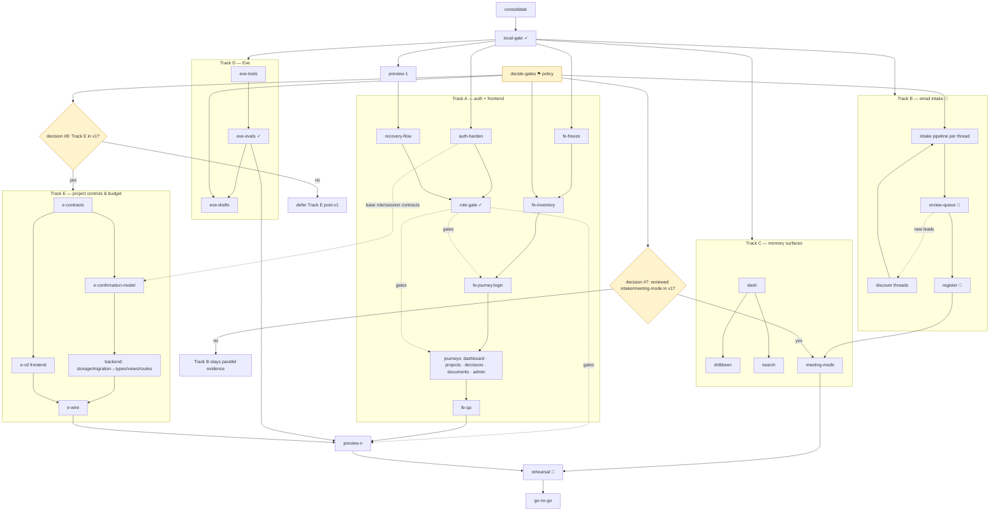
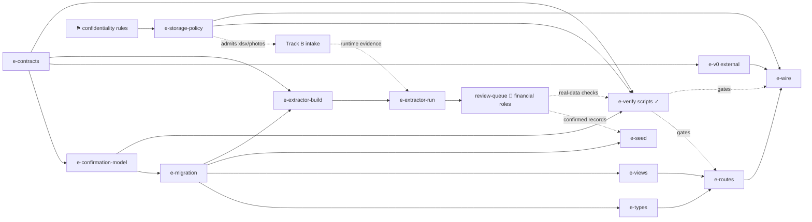

# Graph review: strata.ai implementation plan

Produced with the `graph-engineering-plan` skill (`.claude/skills/graph-engineering-plan/`).
Grounded in the plan text, `HANDOFF.md`, the `scripts/verify-*.mjs` suite, and the migration set.

## Verdict

The plan is a six-phase chain: Phase 0 → 1 → 2 → 3 → 4 → 5 → 6, each waiting for the last. The edge audit finds that only about a third of those waits carry data. After the genuine root dependency (`consolidate → local-gate`), the work splits into **five tracks**: (A) auth + frontend integration, (B) email/document intake, (C) dashboard/memory surfaces, (D) the Eve agent, and conditional Track E (project controls + budget simulation). Preview is an early deploy artifact consumed by browser/recovery verification; unrelated build tracks start from `local-gate`. The plan's biggest strengths are already graph-shaped (staged intake with a human review queue, the agent eval suite, the acceptance matrix); its biggest structural risk is that launch-scope decisions are policy routers, and unresolved routers silently turn into schedule traps. The project-controls/budget addendum is a contract-first diamond, but it must enter v1 only through an explicit scope decision; otherwise it stays post-v1 and does not hold the release hostage.

## Edge audit

| Claimed dependency (original plan) | Classification | What actually crosses |
|---|---|---|
| Phase 0 → everything | **Real data edge** | One consolidated checkout with passing local gate. Genuine root; keep. |
| Phase 0 → Phase 6 Preview deploy | **Real, but misplaced** | The consolidated tree is *all* Preview needs. Preview belongs immediately after Phase 0, not at the end. |
| Phase 1 recovery flow → Preview URL | **Real edge the plan draws backwards** | Phase 1 step 2 requires "a Vercel Preview callback URL" — Phase 1 *consumes* Phase 6's output. Proof the phase order is wrong. |
| Phase 1 → Phase 2 | **Real (partial)** | Frontend login journey consumes the finalized session/role contracts. But Phase 2 steps 1–3 (inventory, mapping, view-model design) consume only the *frozen contract doc*, available at start. |
| Phase 2 → Phase 3 | **Fake** | Email intake reads Gmail and writes Supabase. It consumes nothing the frontend produces. Fully parallel. |
| Phase 3 → Phase 4 (all of it) | **Fake for 4.1, 4.2, 4.4** | Dashboard, drill-downs, and search consume the *schema and RLS policies* (exist now, seeded) — not the completed corpus. Only the outstanding register (4.3) and meeting mode over real data consume Phase 3's reviewed output. |
| Phase 4 → Phase 5 | **Fake** | Eve's read-only tools consume data contracts + server-side scope derivation (Phase 0/1 outputs). The seeded workspace (3 admin cards, 1 member card, law corpus) is sufficient to build and evaluate every tool and every scope eval. The email corpus enriches Eve's *answers*, not its *build*. |
| Phase 3 steps 1→8 as a sequence | **Fake as phases, real as pipeline stages** | These are per-thread stages (capture → attach → extract → classify → dedupe → review), not project phases. Thread A can be in committee review while thread B is still being captured. |
| Phase 2 journeys "one at a time" | **Mostly fake** | After the login journey lands, dashboard/projects/decisions/documents/admin integrations are independent (isolate via worktrees; gate each on the acceptance suite). |
| §6 decisions → "before implementation expands" | **Policy gates, unscheduled** | Gmail scope + confidentiality rules gate all of track B; frontend delivery format gates track A's shape; approver identity gates the review queue. No build work unblocks them — a committee conversation does. They belong at the very front, in parallel with Phase 0. |
| Committee review → outstanding register → rehearsal | **Real — keep hard** | Governance-critical. The register must remain "a reviewed register, not an AI-generated assertion." Do not parallelize past this edge. |

**Score: of the six phase-boundary waits, three are fake or mostly fake, one is drawn backwards.** That is where all the schedule compression lives.

## Node inventory

Tiers: **H** = human/committee judgment, **S** = strong model / senior effort, **C** = cheap model / mechanical.

| Node | Job | Input | Output contract | Tier |
|---|---|---|---|---|
| `decide-gates` | Resolve launch policy/scope decisions, including intake/meeting-mode v1 scope and Track E v1 inclusion | Committee | Signed-off scope/confidentiality/approver/frontend-format/AI-mode/intake-v1-scope/Track-E-scope doc | H |
| `consolidate` | Merge publishable/secret-key migration into Vercel-linked checkout; reconcile migration rename; migrate or alias env names in app clients and scripts (they still read legacy `NEXT_PUBLIC_SUPABASE_ANON_KEY` / `SUPABASE_SERVICE_ROLE_KEY`, e.g. `src/lib/supabase/server.ts:7`, `src/lib/supabase/client.ts:8`, `src/lib/supabase/middleware.ts:7`, `scripts/verify-budget-workflow.mjs:15`, `scripts/verify-budget-workflow.mjs:16`) | Two checkouts (`HANDOFF.md` paths) | One tree; migration deletion/replacement resolved; middleware import preserved; app clients and every script resolve keys under the new naming | S |
| `local-gate` | Run lint, build, `verify:security`, `verify:production-ready`, `verify:documents`, `verify:ai`, `verify:law`, live auth, live members — **under the migrated env names**, proving alias/name compatibility, not just Vercel dashboard naming | Consolidated tree | All scripts pass with new key names; evidence recorded | C (run) |
| `preview-1` | Configure Preview env names; deploy first Preview (never `--prod`/promote) | Gate-passing tree | Ready Preview URL | C |
| `auth-harden` | Finalize lifecycle + role enforcement in routes/policies | Existing `member_invites` migration, API routes | Role matrix enforced server-side; audit events per status change | S |
| `recovery-flow` | Login/password-recovery with tested redirect | Preview URL (from `preview-1`) | Recovery round-trip proven in Preview | S |
| `role-gate` | Base acceptance run (admin, member, suspended, uninvited, signed-out) | Any Preview deployment | `verify:auth-browser` + base role checks pass | C (run) |
| `fe-freeze` | Freeze backend contracts + acceptance suite | Current APIs | Contract document | S |
| `fe-inventory` | Inventory incoming frontend; map screens → contracts; gap list | Delivered frontend + contract doc | Gap list before any schema change | S |
| `fe-inventory` status | **done** (2026-08-01) — output in `FRONTEND-GAPS.md`; decision #4 gates the journey nodes, not this one | — | 20 gaps, 3 D4-conditional, 3 stop-and-review change requests | — |
| `fe-journey:{login,dashboard,projects,decisions,documents,admin}` | Integrate one journey | Contract doc + gap list | Journey passes existing workflow/auth/document tests + `role-gate` | S |
| `fe-qa` | Accessibility + responsive QA | Integrated UI | Manual QA evidence, both roles | H |
| `intake:{thread}` | Per-thread pipeline: capture → attachment intake → extract → classify → dedupe | Gmail thread; `decide-gates` | Immutable source metadata, checksums, proposed classification, dedupe key | C (capture/extract/dedupe) + S (classify) |
| `review-queue` | Approve / correct / hold / exclude each proposed record | Intake proposals | Audit-logged decision per record | H |
| `register` | Outstanding-register cards from approved records | Reviewed records | One owner, due date, source link per card | H |
| `dash`, `drilldown`, `search` | Memory surfaces over schema + RLS | Seeded schema | Every claim traceable to a source record | S |
| `meeting-mode` | Briefing/agenda export from reviewed register | `register` | Export only; no autonomous send | S |
| `eve-tools` | Eve + 4 read-only tools, identity passed per run, scope derived server-side | Data contracts, RLS, seeded workspace | Cited answers or explicit "evidence missing" | S |
| `eve-evals` | Scope/citation/fallback/session eval suite | `eve-tools` | All evals pass on seeded data | C (run) |
| `eve-drafts` | Approval-gated draft tools | `eve-tools` + `decide-gates` (approver) | Nothing persists/sends without human approval | S |
| `preview-n` | Redeploy Preview after each integration wave | Current tree | Ready Preview; `role-gate` re-run | C |
| `rehearsal` | v1 launch rehearsal over the chosen release scope | Track A + Eve evals, plus meeting-mode if intake is in v1, plus e-wire if Track E is in v1 | Rehearsal evidence; conditional inputs named | H |
| `go-no-go` | Final report: evidence, gaps, recovery, next scope | Everything | Go/no-go document; production untouched | S+H |

## Topology

Named shapes:
- **Root chain:** `consolidate → local-gate` is the only genuinely serial build prefix; `preview-1` is an early deploy artifact consumed by `recovery-flow`, not a universal gate.
- **Fan-out after `local-gate`**, not after Preview. Track B intake, Track C memory surfaces, Track D Eve, and Track E contract work do not consume a Preview URL. Only browser/recovery verification does.
- **Diamond** inside Track A: login journey splits into five independent journey integrations (worktree isolation — they write to the same UI tree), merging at `fe-qa`.
- **Pipeline** inside Track B: per-thread stages stream; the five priority threads (insurance renewal, fire-safety quote, major-works variations, short-stay security, payment/legal) go through end-to-end **first**, before broad discovery finishes. Fast threads reach committee review early instead of idling behind full-corpus capture.
- **Router** on frontend arrival: *if* the simplified frontend is delivered → `fe-inventory` path; *if it slips* → continue on the current UI (the plan's own "read-only dashboard useful before advanced features" clause, made an explicit route instead of a hope). Judgment in the assessment, branching deterministic.
- **Router** on frontend delivery format (decision #4, `replace` vs `refactor-into`): this gates the six `fe-journey:*` integration nodes — the shape of Track A's build work — and **not** `fe-inventory`. The inventory node consumes a delivered frontend plus the frozen contract; neither input is the #4 answer, so it runs unblocked and emits both branches for the gaps whose remedy depends on the route. Scope note added 2026-08-01 after the edge was found mis-placed: `fe-inventory` had been recorded `blocked(decision-4)`, which — unlike decisions #7 and #8 — carries no temporary default and so could never clear, leaving the delivered frontend to be merged with no gap list ever produced. General rule: **edge a human-decision router onto the node whose output contract consumes the answer, not onto every node downstream of the topic.** Read-only analysis nodes in particular should run early and emit conditional output rather than wait.
- **Router** on AI mode (§6 decision): live-gateway path vs fallback-launch path — both already supported by `verify:ai`; route, don't wait.
- **Router** on intake/meeting-mode scope: decision #7 must resolve to `yes` or `no` before v1 fan-in. `yes` makes `meeting-mode` feed rehearsal; `no` keeps Track B as parallel evidence.
- **Router** on Track E scope: decision #8 must resolve to `yes` or `no` before Track E execution. `yes` puts `e-wire` on the v1 fan-in; `no` defers Track E and removes it from v1 rehearsal.

## Verifiers

The plan already has strong verifier instincts — keep them and formalize the consequential gates:

1. **Role-scope gate as perspective-diverse verify (reusable, not one-shot).** The five roles (admin / member / suspended / uninvited / signed-out) are five lenses trying to kill the same claim: "visibility is correctly scoped." The plan runs this once in Phase 6; on the graph it is a cheap gate (`role-gate`) re-run after *every* journey integration and every Preview redeploy. Regressions surface at the node that caused them, not at the end.
2. **Intake pre-verifier (cheap tier) in front of the human panel.** Checksum dedupe, MIME validation, low-confidence-extraction flagging run mechanically so the committee review queue — a human judge panel — adjudicates only genuine judgment calls (confidentiality, ownership, next action). Never spend the H tier on plumbing.
3. **Eve eval suite as adversarial verify — net-new unless proven otherwise.** Current `verify:ai` covers the generic AI route/context layer, not a four-tool Eve surface with session-isolation and draft-tool gates. Treat `eve-evals` as new coverage until it contains concrete scope, citation, fallback, and cross-session leak attempts against Eve itself. Draft tools do not land until the read-only tools survive those skeptics.
4. **Confirm-figure verifier as a hard financial gate.** This is separate from the base auth role gate: admin/chair/treasurer positive tests plus secretary/member negative tests must pass through both the API and direct table writes before any draft→official promotion ships.

Edges that do **not** need verifiers: the reduce steps (flattening gap lists, aggregating verify output) — deterministic, zero-cost, adding verification there is wiring rent.

## Cycles

| Cycle | Dry-out rule | Dedupe key | Failure mode avoided |
|---|---|---|---|
| Mailbox discovery (Track B): reading threads surfaces new senders/contractors/topics to search | Stop after **2 consecutive** search-expansion rounds yielding no new threads | Gmail message-ID + attachment checksum, checked against **everything seen — including records the committee excluded** | If you dedupe only against *approved* records, every excluded forward and quoted chain re-enters the review queue each round and the loop never dries. The plan's step 6 (dedup) must be built on the seen-set, not the approved-set. |
| §4 self-checking loop (per workstream) | All criteria ≥ 8 → FINAL | n/a | Sound as written — but run **one loop per parallel track**, not one global loop serializing the whole graph. |

## Critical path

**Binding chain (first usable release, per the plan's definition of done):**

`consolidate → local-gate → (auth-harden || preview-1 → recovery-flow) → fe-journey:login → journey diamond → fe-qa → preview-n → rehearsal → go-no-go`

Everything else runs off that binding chain only if it is **not** in the v1 rehearsal definition. This is not a vibes call:
- The main topology fan-in to `preview-n` is `fe-qa` (`QA`), `eve-evals` (`EE`), the `role-gate` (`RG1`) as a gate, and `e-wire` (`EWR`) only when decision #8 is yes. The fan-in to `rehearsal` is `preview-n`, plus `meeting-mode` only when decision #7 is yes.
- If the committee requires `meeting-mode` over a reviewed register for v1, then Track B (`intake → review-queue → register → meeting-mode`) is on the critical path and committee review capacity is the bottleneck.
- If the committee requires Track E in v1, then `e-contracts → e-confirmation-model/e-storage-policy/e-migration/e-verify/e-wire` joins the critical path through the Track E scope router.
- Decision #8 landed as `defer-track-e-post-v1` on 2026-08-04, so Track E does **not** fan into v1 rehearsal.
- Until the intake scope decision says otherwise, Track B produces parallel rehearsal material when ready; it does **not** silently gate v1.

**Waste in the original:** the linear plan holds Track B behind Phase 2 and Track D behind Phases 3–4. Neither wait carries data. On the graph, intake's human-review cadence starts earlier and overlaps build work. If intake is made v1-critical, that human cadence becomes the binding bottleneck rather than free parallelism; do not generate more intake proposals than the committee can actually review.

**Barriers that survive scrutiny (keep, with justification):**
- `local-gate` before `preview-1` — trust requires the *whole* check set passing at once.
- `review-queue` before `register` — governance: the register is a reviewed artifact by definition.
- `rehearsal` — genuinely needs every **in-scope** track's output together; out-of-scope Track B/Track E work must not sneak into this barrier.
- `go-no-go` — terminal fan-in; the report compares against the total.

Everything else that looked like a barrier in the linear plan is a pipeline stage.

## Addendum: project controls & budget simulation (Track E)

Review of `IMPLEMENTATION_PLAN_ADDENDUM.md`, integrated as a fifth track.

### Where the addendum is already graph-shaped (keep as designed)

- **Deterministic read models own the financial truth.** Views/RPCs (`project_financial_summary_v`, `simulate_budget_scenario`) compute committee-facing figures in code, with AI confined to extraction drafts. This is the "reduce is free" principle applied correctly: rollups and simulations are plumbing, not judgment — zero AI at runtime, fully reproducible.
- **Append-only `project_cost_events` ledger** — every figure derivable and auditable; the product principle ("what is it, where did it come from, who confirmed it") is a citation contract on every node output.
- **"No AI-extracted number becomes official without review"** is a verifier gate, stated explicitly.

### Edge audit of the addendum's 10-step sequence

| Claimed dependency | Classification | What actually crosses |
|---|---|---|
| Steps 1–7 backend → step 8 "provide v0 with JSON contracts" | **Backwards — the biggest finding.** | The addendum itself says v0 should build against *stable JSON contracts, not tables*. The contract is the edge artifact — so mint it **first**. Then backend (migration → types → views → routes) and v0 frontend build **in parallel** against the same contract, converging only at step 10 (wiring). Placing contracts at step 8 serializes the two longest jobs for no data reason. |
| Migration → types → views → routes | **Real chain** | Schema → generated types → read models → routes each consume the previous artifact. Keep serial. |
| Step 5 (draft/extraction tables) after step 4 | **Fake** | More schema; belongs in the same migration wave, parallel with views. |
| Step 6 (seed SP6430 records) after step 5 | **Fake** | Seeding consumes only the migration. Runs parallel with views/routes. Note: the AGM forecast and NB/EBRS payment figures quoted in the addendum are *email-derived evidence*, so seed them as `source_status: unconfirmed` drafts — per the addendum's own rule they are not official until an authorised role confirms them. |
| Step 9 (verification scripts) second-to-last | **Fake** | Verifiers are written against the contract, so they can be drafted in wave 1 and run as the gate on each backend node. The existing `verify:budget` / `verify:quote-invoice` scripts are **predecessor patterns, not coverage**: they exercise the legacy tables (`budget_lines`, `invoices`, `quote_reviews` — see `scripts/verify-budget-workflow.mjs:101`, `scripts/verify-budget-workflow.mjs:103`, `scripts/verify-budget-workflow.mjs:106`), none of the addendum surface (`project_budget_lines`, `fund_forecasts`, scenario math, draft-never-official). All four addendum verifiers are net-new work. Writing them last means building unverified and verifying once. |
| Step 10 (wire frontend) | **Real fan-in** | Needs stable backend + built frontend together. The one barrier that earns its wait. |
| Addendum §5 evidence-first ingestion → Track B | **Same pipeline, not a new one** | Import → store raw → extract → review → confirm → audit is exactly Track B's per-thread pipeline. The new extractors (`payment-sheet-extract`, `budget-forecast-extract`, `project-update-extract`) are additional classify-stage nodes in the existing intake pipeline, and the confirmation queue is the same `review-queue` with financial-role routing. Do not build a second ingestion system. |
| Addendum permissions → Phase 1 roles | **Real edge into Track A — but smaller than it looks** | The `treasurer` role already exists: it is in the `member_role` enum (`supabase/migrations/202606250001_initial_strata_governance.sql:6`) and the finance RLS policies already grant admin/chair/treasurer manage rights on accounts, budget periods, and budget lines (`supabase/migrations/202606250001_initial_strata_governance.sql:602`, `supabase/migrations/202606250001_initial_strata_governance.sql:605`, `supabase/migrations/202606250001_initial_strata_governance.sql:608`). What the addendum actually introduces is **confirm-figure semantics** — the capability to promote a draft/AI-extracted figure to official. `auth-harden` must define that capability and prove the negative: secretary and ordinary members cannot confirm official figures. |
| Audit log → official financial state | **Fake and dangerous if implied** | `audit_log` is supporting evidence, not authority. Current RLS lets active members insert audit rows (`supabase/migrations/202606250001_initial_strata_governance.sql:663`), so official promotion must be represented on protected financial/project records or append-only cost events with server-derived `confirmed_by_member_id` / `confirmed_at`; audit rows can mirror that fact after the authoritative write. |
| Storage MIME policy → Track E wire/verify | **Real data edge** | Spreadsheet/photo import is an acceptance criterion. The storage policy migration must gate `e-verify` and `e-wire`, not only runtime intake. |

**Repo-level gap found while cross-checking:** the `strata-documents` bucket allows exactly four MIME types — text, markdown, PDF, DOCX (`supabase/migrations/202606260002_document_storage_bucket.sql:8`, `supabase/migrations/202606260002_document_storage_bucket.sql:9`, `supabase/migrations/202606260002_document_storage_bucket.sql:10`, `supabase/migrations/202606260002_document_storage_bucket.sql:11`). The addendum requires **spreadsheets** (NB payment sheets) and **photos** (evidence gallery), so this is release-blocking for Track E, not merely a question: it is modeled below as an explicit `e-storage-policy` node, gated by the confidentiality decision (unit-interior photos) from `decide-gates`.

### Track E node inventory

| Node | Job | Input | Output contract | Tier |
|---|---|---|---|---|
| `e-contracts` | Define JSON contracts for Projects control view + Budget tab + scenario API | Addendum product spec | Versioned contract doc handed to both v0 and backend | S |
| `e-confirmation-model` | Define draft→official promotion semantics for financial figures | `e-contracts`, `auth-harden` role/session contracts | Status transitions, `confirmed_by_member_id`, `confirmed_at`, protected official fields, and audit mirroring rules defined | S |
| `e-storage-policy` | Extend `strata-documents` bucket MIME allowlist (xlsx, images) per confidentiality rules | `decide-gates` (photo confidentiality) | Bucket-policy migration applied; spreadsheet/photo intake admissible; storage smoke tests pass | S |
| `e-migration` | New tables (`project_budget_lines`, `project_cost_events`, `project_updates`, `project_evidence_links`, `fund_forecasts`, `budget_scenarios`) + draft-extraction tables + RLS + confirmation state | `e-contracts`, `e-confirmation-model` | Migration applied; RLS on every table; direct official promotion blocked for unprivileged roles | S |
| `e-types` | Regenerate Supabase TS types | `e-migration` | Compiling types | C |
| `e-views` | Summary views + `recalculate_*` / `simulate_budget_scenario` RPCs | `e-migration` | Deterministic figures, no AI at runtime | S |
| `e-routes` | Control-summary, updates, budget-lines, cost-events, import-source, forecasts, scenarios routes | `e-views`, `e-types` | RLS-protected, audited writes | S |
| `e-seed` | Seed SP6430 drafts from AGM forecast + July payment sheet | `e-migration` | Records marked unconfirmed with evidence links | C |
| `e-extractor-build` | Build `payment-sheet-extract`, `budget-forecast-extract`, `project-update-extract`, `cost-risk-summary`, `scenario-explanation` AI tasks | `e-contracts`, `e-migration` draft tables | Extractor tasks compile and return fields + confidence + citations + missing-info + disclaimer | S |
| `e-extractor-run` | Run extractors over reviewed intake evidence | Track B pipeline output, `e-extractor-build` | Candidate draft rows only; no official figures | C (extract tasks) / S (`cost-risk-summary`, `scenario-explanation`) |
| `e-verify` | Net-new verify scripts (modeled on, not covered by, legacy `verify:budget`/`verify:quote-invoice`): RLS on new tables, summary-calculation correctness, scenario consistency, draft-never-official, confirm-role negatives, storage MIME smoke tests | `e-contracts`, `e-confirmation-model`, `e-storage-policy` | Scripts in `scripts/`, wired into local gate | S (write) / C (run) |
| `e-v0` | v0 builds Projects + Budget screens against contracts | `e-contracts` | Screens consuming contract JSON only | C (external) |
| `e-wire` | Wire frontend to stable backend | `e-routes` + `e-v0` + `e-storage-policy` + `e-verify` passing | Addendum acceptance criteria met | S |

### Track E topology

A textbook diamond: contract splits the work, backend and frontend run as parallel arms, verify scripts gate the edges, `e-wire` is the fan-in. Note the direction of the intake edges: routes and views are **built from the contract alone** — intake never feeds construction. Track B's reviewed output flows only into runtime extractor execution, seed/verification data, and rehearsal material. The extractor build node is contract/schema-driven; the extractor run node consumes real intake evidence.

### Track E verifiers and cycles

- **Draft-vs-official is the load-bearing verifier**: `e-verify` must include tests that attempt to surface an unconfirmed AI-extracted figure as official via API, via view/RPC, and via direct table write. All must fail closed. This is adversarial verification of the addendum's core promise.
- **Confirm-figure lens** joins the reusable role-gate. The `treasurer` role already exists in the enum and finance RLS; what's new and must be proven is the draft→official capability boundary: admin/chair/treasurer can confirm official figures, and — the negative cases that matter — secretary and ordinary members cannot, via API and via direct table write.
- **Audit log is not authority.** Because current `audit_log` insert policy is broad for active members, confirmation tests must assert official state derives from protected financial/project records or append-only cost events. Audit rows may mirror the server-derived confirmation but cannot create it.
- **Storage MIME smoke tests gate Track E.** `e-verify` must upload and reject representative xlsx/image/non-allowed files against the bucket policy so the evidence-gallery and payment-sheet acceptance criteria are actually covered.
- **Scenario consistency** is deterministic: same assumptions in → same projection out; a cheap-tier script compares RPC output against an independent reimplementation of the arithmetic.
- **No new cycles.** Spreadsheet re-imports flow through Track B's existing dedupe (checksum against everything seen), which prevents the same payment sheet forwarded three times from creating three draft ledgers.

## Unblock-now list

Resolvable today, in parallel with all build work — each currently gates a whole subgraph:

1. **Gmail scope + date range** (§6.1) — gates all of Track B.
2. **Retention/confidentiality rules** (§6.2) — gates intake classification and the review queue.
3. **Approver identity** (§6.3) — gates `review-queue` and `eve-drafts`.
4. **Frontend delivery format: replace vs refactor** (§6.4) — determines Track A's shape; the router needs the answer, not the frontend itself.
5. **Live AI vs fallback launch** (§6.5) — a router, not a blocker; both paths are already verified (`verify:ai`), but the release definition needs the choice.
6. **Preview env var names on Vercel** — five minutes of dashboard work (`NEXT_PUBLIC_SUPABASE_PUBLISHABLE_KEY` etc., names only), required by `preview-1`.
7. **Is reviewed intake/meeting-mode in the v1 rehearsal definition?** — if yes, Track B's human review queue is critical path; if no, Track B remains parallel evidence and must not gate `preview-n`.
8. **Is Track E in the first-release definition of done?** (addendum) — hard router output must be exactly `include-track-e-in-v1` or `defer-track-e-post-v1`. If included, `e-wire` joins the critical path and the release date moves; if deferred, Track E explicitly does **not** fan into the v1 rehearsal and converges at a later one.
9. **Photo confidentiality rules** (addendum) — the policy input that gates the `e-storage-policy` node (bucket MIME extension for xlsx/images; currently text/markdown/PDF/DOCX only per `supabase/migrations/202606260002_document_storage_bucket.sql:8`, `supabase/migrations/202606260002_document_storage_bucket.sql:9`, `supabase/migrations/202606260002_document_storage_bucket.sql:10`, `supabase/migrations/202606260002_document_storage_bucket.sql:11`).
10. **Confirm-figure authority and semantics** (addendum) — the `treasurer` role already exists in schema and RLS; confirm which live committee member holds it and sign off the draft→official state model, direct-write restrictions, and server-derived audit semantics.

## Execution notes

**Wave 1 (serial prefix + hard routers, ~one working session):** `decide-gates` (send the committee the launch decisions now, including intake-v1 and Track-E-v1 scope) ‖ `consolidate → local-gate → preview-1`. HANDOFF.md's loop protocol covers the technical prefix almost verbatim — reuse it. `preview-1` feeds `recovery-flow`; do not block Track B/C/D/E contract work behind Preview.

**Wave 2 (five tracks in parallel):**
- A: `auth-harden` ‖ `recovery-flow` (against preview-1) ‖ `fe-freeze`; then the journey diamond as the frontend arrives — journeys in **worktree isolation** (they write to the same tree), each gated by the acceptance suite + `role-gate`.
- B: priority-five threads through the full pipeline first; broad discovery loops until dry behind them. If reviewed intake is in v1 scope, throttle generation to committee review capacity because the review queue is critical path.
- C: `dash`/`drilldown`/`search` against seeded data now; `meeting-mode` waits only on `register`.
- D: `eve-tools → eve-evals` against seeded data; treat `eve-evals` as net-new Eve-specific coverage unless an existing script proves the same surface. `eve-drafts` lands only after evals pass and §6.3 lands.
- E: only start if the Track E router returns `include-track-e-in-v1` or if explicitly doing post-v1 work. `e-contracts` first, then `e-confirmation-model`, backend chain ‖ v0 build ‖ verify-script drafting (net-new scripts — legacy `verify:budget`/`verify:quote-invoice` are patterns, not coverage); `e-storage-policy` gates `e-verify` and `e-wire`; `e-seed` marks all email-derived figures unconfirmed; `e-extractor-build` is contract/schema-driven and `e-extractor-run` consumes Track B output at runtime; `e-wire` only when `e-verify` gates pass.

**Wave 3 (fan-in):** `preview-n` with base role-gate, Eve-specific evals, and any in-scope Track B/Track E gates → `rehearsal` → `go-no-go`. Production untouched throughout.

If executing tracks with agent fleets via dynamic workflows, see `.claude/skills/graph-engineering-plan/references/patterns.md` — the journey diamond maps to `parallel()` with `isolation: "worktree"`, the intake track to `pipeline()`, mailbox discovery to loop-until-dry, and `role-gate`/`eve-evals` to schema-validated verifier nodes. Run mechanical nodes (extract, checksum, verify-script execution) on a cheap model; keep classification, synthesis, and gap analysis on the strong model; committee approvals stay human by design.
